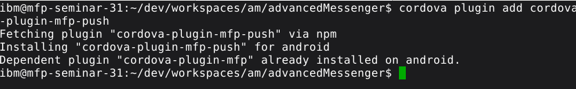

# Lab 1: Add MobileFirst SDK To an Existing App

In this lab, we will be adding MobileFirst SDK into an existing Ionic application.  The sample Ionic app is located in a public git repository.  We will perform the following tasks in this lab:

 - Create a directory to be the git repository to store our work
 - Initialize the git repository
 - Obtain the Ionic sample app from the git repository
 - Add the MobileFirst SDK into the app by adding the MFP plugins into the app
 - Preview the app using `mfpdev`
 - Change the logic of the app to make it MobileFirst-aware

------------
## Obtain the Ionic Sample App from Git
 1. Open a **Terminal** window.
 2. Enter `cd ~/dev/workspaces` in the terminal.
 3. Enter `mkdir am` to create a directory to store our work.
 4. Change to the newly created directory by entering `cd am`.
 5. Initialize the directory as git using this command: `git init`
 6. Add a remote repository where our sample app is located: `
 git remote add origin https://github.com/andriivasylchenko/advancedMessenger
 `
 7. Download our sample app source code by running the following command: `
 git pull origin initial
 `
 8. Enter `ls` to list the directory content. You will see two folders: advancedMessenger and mockServer folder.  The advancedMessenger is the sample Ionic app and the mockServer folder is the mockup server that acts as the backend.  MockServer is written in node.js.  We will start this mockup backend in the next step.


## Start the Mock Server

 1. Change directory by typing `cd mockServer`.
 2. To start the MockServer, type the following command: `node server.js`

	


 3. Check that the service is running.  Open a browser and enter the URL at `http://localhost:4567/api`.  

	
 4. Let's change the terminal name so that we can distinguish the terminal that has the mock server started.  **This terminal needs to be kept open for the server to be running**.
 5. In the terminal window, select **Terminal** from the main menu > select **Set Title**.  Enter the title as `mock`.

	

	

Now that we have our mockup server set up, we will continue with the mobile app.

## Install the Dependencies for the Sample Ionic App

Although we have downloaded the Ionic app from github, there are some basic dependencies that are required before we can run this Ionic app.  The dependencies include the Cordova plugins for the mobile app, including the Cordova plugins for MobileFirst Foundation.

 1. In the terminal, open a new tab.  To do this, select **File** from the main menu > select **Open Tab**.
 2. In a new terminal tab, enter the following command:
 `cd ../advancedMessenger/`

 	

 3. There are some dependencies that the app needs.  Since the dependencies were already listed in the *package.json* file of the app, we can use the `npm install` command to have the dependencies grabbed from the global npm repository automatically based on the *package.json* file.   Enter the following command in the terminal:  `npm install`

	

 1. Now let's just run the sample Ionic app to see what it looks like.  Enter the following command in the terminal: `ionic serve`.

 5. When you are asked to select a address, select `2` for the **localhost** address.


 6. A web browser is also loaded with the url of localhost:8100.  Our sample app is loaded with some mock data.   We can enable the emulation of a phone from the Chrome's developer tools.  Select the right corner menu on the browser (button showing vertical 3 dots) > **More tools** > **Developer tools**.


 7. Press the **Toggle the device tool bar**  button to show the different selection of emulated devices.  


 8. In the emulator menu, select any phone that you like from the emulator menu.  


 9. Sometimes you might notice a cross-origin error in the console as you can see in the following image. These errors occur because the app is calling other URLs that are not the same origin as the app itself.  For example, it will be calling google.com which is not the same origin as localhost.  This will only happen on a browser preview, we do not need to be concerned with it when it's running on a real device.  Nonetheless, let's just fix it so that we can preview this app properly on the browser.

	

	> Note:
	>
	> You may also notice some Failed to load resource error messages. You may ignore these messages.

 10. To fix the cross-origin error, click on the **CORS** button on the top menu.  In the **Enable cross-origin resource sharing** radio button, disable it and re-enable it again to get it activated.  


 11. Now refresh the browser and the app would look like this:


 12. In the terminal window, we do not need to keep **ionic serve** running, enter `q` to close Ionic.


We have imported the Ionic sample app and successfully previewed the Ionic app so far.  The next step is to add the MobileFirst SDK into the app.  Before doing that, let's start the MobileFirst server first, then we will add the MFP SDK and then preview the app one more time with the SDK added.  


## Starting the MobileFirst Server

 1. In the terminal window, select **File** > **Open Tab** to open one more terminal for running the MobileFirst Server.  
 2. In the new terminal tab, change the directory to `dev/server/` by entering the following commands:
 `cd`, followed by the second command
  `cd dev/server/`, and lastly
  `ls` to examine the content of the *server* folder.

  

 3. This directory contains the MobileFirst server and you can start the server from this directory by entering the following in the command line: `./run.sh -bg`    

  
  >Note:
  >
  >The option `-bg` means that it will be running in the background.  If we close the terminal, it will continue to run in the background.  We can easily see the server log by doing a tail later.

## Adding Plugins for MobileFirst SDK into the Cordova App

The Ionic app is built to use the Apache Cordova framework for accessing native device functions from JavaScript.  Cordova uses a plugin architecture which allows functionality to be added in a modular fashion.  The *MobileFirst SDKs* are packaged as Cordova plugins for easy addition.  There are many *MobileFirst plugins*.  For example, there is the *MobileFirst Core plugin*, which is the basic SDK for MobileFirst.  If you want to allow MobileFirst to manage your application, you have to add the *MobileFirst Core plugin*.  Furthermore, there are other optional plugins that provide additional features of MobileFirst.  For example, if you want to use the JSON datastore feature from MobileFirst, you will add the *MobileFirst JSON plugin*.  In our labs, we will be using the *MFP Core plugin*, the *MFP Push Notification plugin*, and also the *MFP JSONStore plugin*.  We will add them all using the Cordova command line interface (CLI).

 1. Go back to the 2nd terminal tab which is at the *advancedMessenger* directory, and enter the following command to add an Android platform to the app:

	`cordova platform add android`

  

 2. The *MobileFirst Platform Core plugin* is named `cordova-plugin-mfp`.  Enter the following command to add the *MFP Core plugin*:

	`cordova plugin add cordova-plugin-mfp`

  

 3. Enter the following command to add the *MFP Push Notification plugin*:

  `cordova plugin add cordova-plugin-mfp-push`

  

 4. Enter the following command to add the *MFP JSONStore SDK*:  

  `cordova plugin add cordova-plugin-mfp-jsonstore`

  

## Register the App on the MobileFirst Server

For the MobileFirst Server to know about the existence of your application, it needs to be  registered with the MobileFirst Server.  As soon as the registration is completed, your app will be automatically enabled for management by MobileFirst, meaning that you can now disable the app, put an app into maintenance mode, collect mobile analytics and so on.

There are two ways to register the app.  An app can be registered via the administrative console or via the MobileFirst command line interface (CLI).  We will first explore the administrative console, but we will do the actual app registration using the command line.

#### Exploring the MFP Admin Console
The admin console is a web console where you can control and manage the mobile apps.  Let's take a look at the admin console.

 1. In a new browser window, go to `http://localhost:9080/mfpconsole`.

 2. The user id and password is `admin/admin`.  Click **Login**.

   

 3. In the console, you will see that there is no Application that is registered.  If we were going to register it here in the console, we would press the **New** button beside Application section to register.

   

 4. You will be able to register the app via this form.  However, we will not be doing it through the console in this lab.  We will be using the command line interface.  Both methods work exactly the same way.

   	

#### Registering the App via Command Line
Now let's register the app using the MobileFirst CLI.  In MobileFirst, almost all of the administrative functions that can be performed on the web console also have an equivalent CLI command. There are also REST and Ant versions available. These other versions of administrative functions are for ease of automated scripting and can help enable continuous delivery DevOps pipelines.  In addition, if you wanted to put an app on maintenance between 2 am and 4 am, you can set your corporate scheduler to call the MFP command line interface to put the app on maintenance at 2 am and take it off maintenance at 4 am automatically.

 1. Before we register the app to MobileFirst, the Cordova application code needs to be prepared.  The command `cordova prepare` synchronizes the common application hybrid code into the individual platforms (i.e. Android and iOS).  It will physically copy the files from the common directory into the individual platform directory so that the files are aligned.  Enter the following command:  `cordova prepare`

	

 2. The command `mfpdev app register` would register the app to the MobileFirst server.  This particular command will register the app to the localhost server.  You can also use the command to register to any remote server. The syntax would be `mfpdev app register server1` where *server1* can be pre-defined using the command `mfpdev server add Server1 -url https://company.mobile.com:9080 -login admin -password secretPassword!`

 	In this lab, since we are only registering to the localhost, enter the following default command:
 `mfpdev app register`

 	

#### View the Registered App in the MFP Admin Console

 1. Go back to the MFP admin console.  Click the **Refresh** button.  Now you should see the newly registered app.
 

 Since we only added the *Android* platform, therefore, you will only see the *Android* platform.  With this, you can now immediately control the access of the registered mobile app in the *Application Access* section.

## Preview the MFP enabled app

To preview an MFP app, we will not be using the `ionic serve` function as Ionic is not aware of the MFP capabilities.   Instead, we will use `mfpdev app preview` which is MFP-aware.

 1. In the terminal window, enter the following command:
 `mfpdev app preview`

 2. Select `browser: Simple browser rendering` and press **enter**.

  	

 3. It will open a new browser with the app displayed.   You can also enable the Developer tools and also the toggle between devices option as well.  If you forgot how to do it, you can refer to the previous section in this lab.

## Understanding the Proper Execution Order of MFP SDK
You will see there are *wlclient init started* and *wlclient init success* in the console.  It indicates that the MobileFirst SDK is initialized successfully.

  

However, if you scroll up in the console, we would notice that the calls to the Google APIs from the app code seem to have finished before the MobileFirst SDK initialization.  This is because both sets of code were executed in a non-blocking fashion. They run simultaneously and complete their tasks in their own pace.  In this instance, the MobileFirst SDK completes the initialization after the Google API call finishes, which is not the right order.

  

The proper order of execution in a MobileFirst app is that the MobileFirst SDK should always be the first thing that gets initiated, and it should be allowed to complete the entire initialization before any other app calls are made.  This allows the MobileFirst server to manage the app before the app code starts.  For example, during this initialization phase, the MobileFirst Server can check to see if the app is an authentic app (has not been tampered with) before the app gets executed.    

To do that, we want to rearrange the code logic to wait until the MobileFirst SDK initialization completes before loading the actual code of the app.  When the MobileFirst SDK initialization completes, it emits a Javascript event named *mfpjsloaded*.  We will use a listener *Renderer* from the Angular JS framework to listen for this event.   When the *mfpjsloaded* event is noticed, the app code page will be loaded.   The following is the pseudo code for the sequence of events.

  

## Understanding the Code Structure
Let's take a look at the sample app code and setup our system with an automatic build and reload such that we don't have to do manual build during development.  

 1. Open the Visual Studio code editor by clicking on the blue icon on the bottom menu.   Alternatively, you can also choose to use any text editors of your choice such as Sublime Text, Atom, Brackets, or IDE's such as WebStorm.  
  

 2. In the editor, select **File** > **Open Folder**.  
  

 3. Select **dev** > **workspaces** > **am** folder.  Click **OK**.
  
  

 4. In the navigator of the editor, expand **AM** folder > expand **advancedMessenger** folder > expand **app** folder > and click on **app.ts** to open it up in the editor pane.  This is the file that load the app front screen which contains all the app logic.

  

 5. Just to show you that the line `this.rootPage = TabsPage;` is the main screen, we can comment out this line and see that the app is empty.  Comment out the following line and **save** the file.  
`//this.rootPage = TabsPage;`

  

 6. There are multiple ways to build the app.  After a change is made to an Ionic app, we will typically do an `ionic build` and then preview the app in the browser.  However, a more convenient way would be to have Ionic automatically build the app whenever files are changed, and automatically reload the browser.

 7. To enable this, go back to the second tab in your terminal and terminate the current operation of MFP app preview using the `CTRL-C` command, then run the `gulp watch` command

  

 7. Open a **new tab** in the terminal window.   Make sure the directory is **/dev/workspaces/am/advancedmessengers**.   Enter the following command to preview the app and select the **Simple Browsing Rendering**.
 `mfpdev app preview`

  

 8. A new browser is opened.  You should see nothing loaded because we have commented out the page.  Open the **developer tools** to see the log.  

  

 9. Go back to the editor and uncomment the same line to see the browser automatically refresh with the page loaded again.  **Save** the file.

  
  


## Rearranging the App Code
In this section, we will rearrange the code so that it will listen to the *mfpjsloaded* event.  The front page of the app will be loaded when the event is detected.

 1. In the **app.ts** file in the editor, replace the entire class with the following code.   If you are interested in understanding the code, the major changes are the addition of the `renderer.listenGlobal`, which listens for the *mfpjsloaded* event, then invokes the `MFPInitComplete()` function.  This runs the statement `this.rootPage=TabsPage` which loads the front page of the app. The code snippet can be loaded in *Lab01_Snippets.txt* <JANE todo location>.

	```javascript

	import {Component, Renderer} from '@angular/core';
	import {Platform, ionicBootstrap} from 'ionic-angular';
	import {StatusBar} from 'ionic-native';
	import {TabsPage} from './pages/tabs/tabs';

	@Component({
	  template: '<ion-nav [root]="rootPage"></ion-nav>'
	})
	export class MyApp {
	  private rootPage:any;

	  constructor(private platform:Platform, renderer: Renderer) {

	    console.log('constructor done');

	    renderer.listenGlobal ('document', 'mfpjsloaded', () =>{
	      console.log ('--> MFP API init complete');
	      this.MFPInitComplete();
	    })

	    platform.ready().then(() => {
	      StatusBar.styleDefault();
	    });
	  }

	  MFPInitComplete(){
	     console.log ('--> MFPInitComplete function is called');
	    this.rootPage = TabsPage;
	  }

	}

	ionicBootstrap(MyApp)

	```

Now the browser should be reloaded with the changed app.  Let's look at the log and validate the sequence of event.  You will see that the MFP init event is completed before the app codes executes.  This is the correct way of structuring a MobileFirst app.

  


## Summary
Congratulations! In this lab, we have accomplished a lot.  We imported an Ionic sample app and made it into a MobileFirst app by adding the Cordova plugins and performing a few simple modifications.  We have learned how to start a MobileFirst test server and preview an app.  We also learned and modified the app to properly initialize the MobileFirst client-to-server connection prior to loading the main app.  This enables the features of MobileFirst Foundation including application management as well as the rest of the features that we will be exploring in successive labs.
