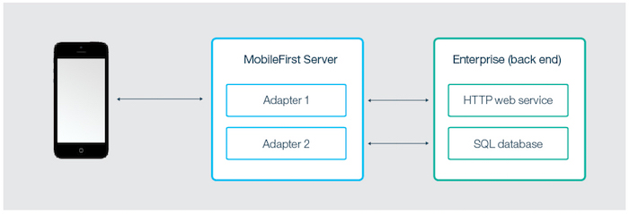
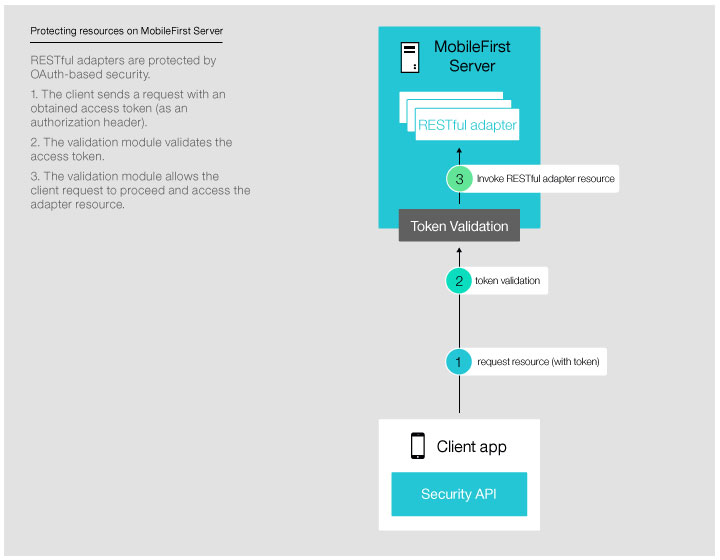
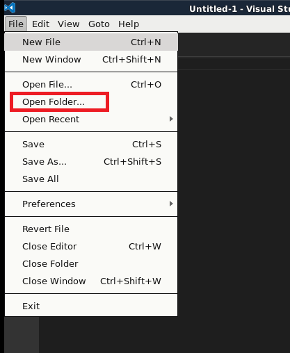
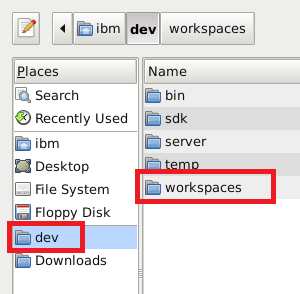
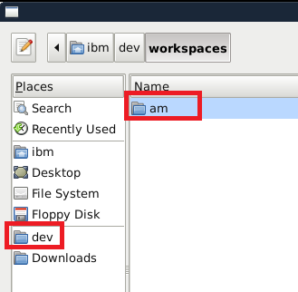

## Lab 2: Using Java and JavaScript Adapters with MobileFirst Server

MobileFirst Adapters are Maven projects that contain server-side code implemented in either Java or JavaScript. Adapters are used to perform any necessary server-side logic, and to transfer and retrieve information from back-end systems to client applications and cloud services.

Each adapter has its own isolated sandbox, which runs without knowing about or interrupting other adapter sandboxes. That said, adapters can still communicate with one another by calling server-side API which makes "adapter mashup" possible, or the ability to aggregate calls to multiple backends and return a result.

It is also possible to include third-party Java libraries that are required by the adapter code by defining them as Maven dependencies in the adapter's **pom.xml** file.

Adapters also support DevOps needs:

- You can "hot deploy" adapters, meaning deploy, undeploy, and redeploy them at run time. This capability lends great flexibility to the MobileFirst server-side development process.
- An adapter can have user-defined properties, which can be configured by administration personnel without redeploying the adapter. This feature lets you customize adapter behavior for different environments, for example development, testing, and production.

Continue reading for an overview of Java and JavaScript adapters. Then follow the tutorials in the sidebar navigation to learn how to create, build, update, develop, test and deploy Java and JavaScript adapters, learn how to use IDE's for adapter development, collect server-side logs, as well as more advanced topics such as adapters mashup and Cloudant integration.



### Benefits of using adapters

#### Universality

- Adapters support multiple integration technologies and back-end information systems.

#### Read-only and transactional capabilities

- Adapters support read-only and transactional access modes to back-end systems.

#### Fast development

- Adapters use simple XML syntax and are easily configured with JavaScript API or Java API.

#### Security

- Adapters use flexible authentication facilities to create connections with back-end systems.
- Adapters offer control over the identity of the connected user.

#### Transparency

- Data that is retrieved from back-end applications is exposed in a uniform manner, regardless of the adapter type.

### Benefits specific to Java adapters

- Ability to fully control the URL structure, the content types, the request and response headers, content and encoding
- Ability to test the adapter by using a 3rd-party tool such as Postman
- Easy and fast deployment to a running MobileFirst Server instance with no compromise on performance and no downtime
- Security integration with the MobileFirst security model with no additional customization, by using simple annotations in the source code

## JavaScript adapters
JavaScript adapters provide templates for communicating with HTTP and SQL back-ends. These templates contain a set of services called procedures. Mobile apps can call these procedures by issuing AJAX requests. The procedure retrieves information from the back-end application and return data to the application. Using a REST interface, you can benefit from the OAuth 2.0-based security framework provided by MobileFirst.

- If the format of the data is JSON then the MobileFirst Server keeps the data intact. Otherwise the MobileFirst Server automatically converts it to JSON.
- Alternatively you can provide XSL transformation to convert the data to JSON. In this case, the returned content type from the back-end must be XML. Then, you can use an XSLT transformation to filter the data based on requirements.
- With an HTTP adapter, you can send GET or POST HTTP requests and retrieve data from the response headers and body. HTTP adapters work with RESTful and SOAP-based services, and can read structured HTTP sources such as RSS feeds.
- With an SQL adapter, you can communicate with any SQL data source. You can use plain SQL queries or stored procedures.

## Java adapters
Java adapters are based on the JAX-RS 2.0 specification and are thus written in Java, and expose a full REST API to the client. In Java adapters, it is up to the developer to define the returned content and its format, as well as the URL structure of each resource. The only exception is if the client sending the request supports GZip, then the returned content encoding of the Java adapter is compressed by GZip. All operations on the returned content are implemented and owned by the developer.

The diagram below depicts how a mobile device can access any Java adapter from its REST endpoint. The REST interface is protected by the MobileFirst OAuth security filter, meaning that the client needs to obtain an access token to access the adapter resources. Each of the resources of the adapter has its own URL, so it is possible to protect MobileFirst endpoints using any firewall. The REST interface invokes the Java code (JAX-RS service) to handle incoming requests. The Java code can perform operations on the server by using the Java MobileFirst Server API. In addition, the Java code can connect to the enterprise system to fetch data, update data, or perform any other operation that the enterprise system exposes.



## What you will be doing in this lab? ##

- Create a JavaScript Adapter
- Build and Deploy the JavaScript Adapter
- Test the JavaScript Adapter using Swagger
- Create a Java Adapter
- Build and Deploy the Java Adapter
- Test the Java Adapter using Swagger
- Modify the sample app to use the JavaScript and Java Adapter
- Test the sample app

## Backend Services ##
In this lab, we are going to create adapters that connect to our mock services.  There are two mock services that we will be connecting.  Let's test the services to make sure they are all working.

1. If your mock server is not already started, start it now by changing to the following directory using `cd ~/dev/workspaces/am/mockServer` then entering the following command in the terminal window: `node server.js`


2. In the web browser, go to this URL which will bring back a list of employees:  
http://localhost:4567/employees.


3. Now access this URL which will bring back a list of news items:  
http://localhost:4567/news.


4.  Minimize this terminal window for the remainder of this lab, so that our Node.js mock services will remain running.

## Create a JavaScript Adapter
1. Open a new terminal window, and ensure that you are in the **/dev/workspaces/am/** directory.

2. Enter the following command to create a JavaScript adapter:  
`mfpdev adapter create`
3. Enter **employeeAdapter** as the **adapter name**.
4. Select **HTTP** as the **adapter type**.
5. Enter **com.adapters** as the **group ID**.
  
You will see that the adapter has been successfully created.

## Modify the adapter.xml
In a JavaScript adapter, the host name and port number of the backend service is configured in an *adapter.xml* file. The actual path to the backend service is inside the JavaScript file.  The *adapter.xml* file also specifies the name of the method we want to create for the mobile app to use.

 1. Open the Visual Studio editor by clicking on the blue icon on the bottom menu.  You can also choose to use your favorite editor of choice such as Sublime Text, Atom, or Brackets if you wish.  
  

 2. In the editor, select **File** > **Open Folder**.  
  

 3. Select **dev** > **workspaces** > **am** folder.  Click **OK**.

    

    

  

 3. Expand **employeeAdapter** > **src** > **main** > **adapter-resources** > **js** > click on **adapter.xml** to open it in an editor.     


1. In the editor pane, change the protocol from *https* to **http**.
2. Change the domain to **localhost**.
3. Change the port to **4567**.

1. Since our adapter will only create one procedure for the mobile app to call.  Currently, the adapter.xml has default two procedures.  We will delete the last procedure and replace the *getFeed *procedure to *getRating*. **Save** the file.

**Before**


**After**


#### Final Adapter.xml file
The final adapter.xml file looks as follows:

    <?xml version="1.0" encoding="UTF-8"?>
    <!--
    	Licensed Materials - Property of IBM
    	5725-I43 (C) Copyright IBM Corp. 2011, 2016. All Rights Reserved.
    	US Government Users Restricted Rights - Use, duplication or
    	disclosure restricted by GSA ADP Schedule Contract with IBM Corp.
    -->
    <mfp:adapter name="employeeAdapter"
    			 xmlns:xsi="http://www.w3.org/2001/XMLSchema-instance"
    			 xmlns:mfp="http://www.ibm.com/mfp/integration"
    			 xmlns:http="http://www.ibm.com/mfp/integration/http">

    	<displayName>employeeAdapter</displayName>
    	<description>employeeAdapter</description>
    	<connectivity>
    		<connectionPolicy xsi:type="http:HTTPConnectionPolicyType">
    			<protocol>http</protocol>
    			<domain>localhost</domain>
    			<port>4567</port>
    			<connectionTimeoutInMilliseconds>30000</connectionTimeoutInMilliseconds>
    			<socketTimeoutInMilliseconds>30000</socketTimeoutInMilliseconds>
    			<maxConcurrentConnectionsPerNode>50</maxConcurrentConnectionsPerNode>
    		</connectionPolicy>
    	</connectivity>

    	<procedure name="getRating"/>

    </mfp:adapter>


## Implement the JavaScript Adapter
When we created a JavaScript Adapter, the tool automatically generated some sample code and the sample XML configuration.  We will replace the sample code with our code in the adapter.  The implementation is called **employeeAdapter-impl.js**.  

1. In the editor, navigate to **am/employeeAdapter/src/main/adapter0resources/js/employeeAdapter-impl.js**.  Open **employeeAdapter-impl.js** in the editor.

	

2. Delete all code from the file and replace with the following and **save** the file.

	```javascript
	function getRating() {
     	var input = {
     	method : 'get',
     	returnedContentType : 'json',
     	path : 'employees'
     	};

     	return MFP.Server.invokeHttp(input);
     }
	```

	

## Build and Deploy the JavaScript Adapter

1. In a terminal window, make sure you are in the following directory:
**dev/workspaces/am/employeeAdapters**
	

2. Enter the following command to build the adapter:  
`mfpdev adapter build`  

	  

 You will see the adapter was built successfully.  This means there is now a compiled version of the adapter ready to deploy.

1. There are multiple ways to deploy the adapter.  We could deploy an adapter using `mfpdev adapter deploy` from the MobileFirst Command Line (CLI) or we could deploy it using the MobileFirst Operations console.  In this exercise, we will use the console to deploy the adapter. In a web browser, go to the url **http://localhost:9080/mfpconsole** and login as **admin/admin**.

2. In the Actions menu on the right corner, select **Deploy Adapter**.


1. Click **Browse** to select the adapter to deploy.  

2. Select **am** folder > **employeeAdapter** folder >  **target** folder > select **employeeAdapter.adapter** file and click **Open**.


1. Click **Deploy**.  


1. You will see that the adapter has deployed successfully as shown.  


## Testing the Adapter using Swagger
IBM MobileFirst Platform comes with a Swagger web GUI for testing adapters. All adapters created on the platform are by default already secured with basic MobileFirst security.  It means the adapters by default are not publicly callable API's - they are only callable from a MobileFirst app. This is extremely important since exposing your adapters completely without any security is an unacceptable level of risk to your backend resources.  For example, random crawlers could call open adapters at high load and potentially bring down the server if the adapters were not secured by default.

The adapter can only be called from a valid MobileFirst app. In order to test the adapter from a web browser using the Swagger GUI, we will need to provide an authorization token for the Swagger GUI.  This access token is called the *confidential client* which can be configured in the MobileFirst Operations Console, as we are about to do.

1. In the MobileFirst Operations console, select the **Runtime Settings** on the left menu.  On the right pane, select the **Confidential Clients** tab.


2.  You will notice that there are several confidential clients configured by default.  On the first row with the **test** client ID, click on the eye button to see the password which is **test** as well.  We will be using this client in the Swagger GUI for testing the adapter.


3. On the left side navigator, select **Adapter** > **employeeAdapter**.  In the main pane, change to the **Resources** tab and select **View Swagger Docs** button.


5. Click on the **default** link to expand it.  


7.  Click on the **/getRating** link to expand it.


7. On the far right, toggle the button and turn it on.  As you toggle the button, a dialog will popup.  Select **DEFAULT_SCOPE** in that dialog.  Click **Authorize**.  


1. Enter **test / test** as the user name and password which is the pre-defined *confidential client*.  Click **Log in**.


2. Once the login is successful, the toggle button becomes ON.


4. Now we will call the adapter method **getRating**.  Click the **Try it Out** button.  You will see a response being returned from the mock service and an HTTP 200 indicating a successful call.  The adapter test is completed.


## Creating a Dynamic Property in the Adapter
In the adapter, we can create a property that is dynamically changeable during runtime in the Operations console.  This is an extremely useful feature as you move applications between different environments such as Dev, QA, Test, and Production, and configure resources or settings specific to each environment dynamically.

1. Back in the text editor, navigate the folders **employeeAdapter** > **src** > **main** > **adapter-resources** > **js** > and open the file **adapter.xml**.
2. Enter the following line in the XML file right after the `<procedure name="getRating">` and before `</mfp:adapter>`:

 `<property name="endpoint" displayName="Endpoint" defaultValue="employees" />`  

    

  Save the file.

4. Open the file **employeeAdapter-impl.js** in the editor. Replace the getRating() method with the following code and save the file.  This code can be found in the Lab02_Snippets.txt file located in the snippets directory for this lab.  This modification will cause the adapter to use the dynamic property value set in the MFP Server.

	```javascript
	function getRating() {
		var endpoint = MFP.Server.getPropertyValue("endpoint");
		var input = {
		    method : 'get',
		    returnedContentType : 'json',
		    path : endpoint
		};

		return MFP.Server.invokeHttp(input);
	}
	```

	

## Testing the Adapter
1. Return to the terminal window.  We will now build and deploy the adapter using the following command:  

 `mfpdev adapter build`

1. This time we will use the MobileFirst CLI to deploy the adapter.  Deploy the adapter by entering the following command in the terminal:
`mfpdev adapter deploy`


1. Back in the web browser, refresh the MobileFirst Operations Console. The URL is **http://localhost:9080/mfpconsole**.

2. Select the **employeeAdapter** on the left navigation.  Select the **Configurations** tab in the main pane.  Scroll down to the bottom to see the newly created property in the main pane.  You will see the **Endpoint** property.


3. Go to the **Resources** tab and select **View Swagger Docs **button.


4.  Test the adapter as before.  Expand on the **default** link > expand on the **getRating** link.  

5.  Select the toggle for authorization to turn it on.

6.  Check the **DEFAULT_SCOPE** check box and click **Authorize**.

7.  Click on **Try it out** button to invoke the adapter.  


1.  You will see that it's calling the **employees** endpoint on our mock server.


## Change the Dynamic Property in Admin Console
1. In the Operations Console, go to the **Configurations** tab of the employeeAdapter.

2. Change the endpoint property from **employees** to **news**.  Click **Save**.  


1. Go back to the Swagger GUI and click on the **Try it out** button. Notice that the adapter is now calling the **news** endpoint.  


1. To clean up, change the property back to **employees**.  Click **Save**.


## Create a Java Adapter
We will now create a Java Adapter for the **news** endpoint. First we will download the Java Adapter from the MobileFirst Developer Center tutorial and then modify it to suit our needs.

Although we will not be creating a dynamic property inside the Java Adapter in this lab, this feature is available just like we have used with the JavaScript adapter previously.  You can use the `ConfigurationAPI` to obtain the dynamic property from the admin console from within the Java adapter code.

1. In a web browser, browse to the website URL: *https://mobilefirstplatform.ibmcloud.com/tutorials/en/foundation/8.0/all-tutorials/*
2. In the left navigator, go to **Developing Adapters** > **Java Adapters** > **HTTP Adapter**.  
3. Click on **Download Adapter Maven Project** button.   You will be taken to a GitHub repository.


1. In the github page, click on the **Clone or download** button, then click on **Download ZIP** button.


1. Back in the terminal window, enter the following commands to change to the Downloads folder:

	```bash
	cd
cd Downloads
	```

	

1. Unzip the file using : `unzip Adapters-release80.zip`


1. We will copy the unzipped content to our workspace directory.  Enter the following command:

	```bash
	cd Adapters-release80/
	cp -R JavaHTTP /home/ibm/dev/workspaces/am/
	cd
	cd dev/workspaces/am
	cd JavaHTTP/
	```

	

## Modify the adapter.xml for the Java Adapter
1. In the text editor, expand the folders **am** > **JavaHTTP** > **src** > **main** > **adapter-resources**.   Select **adapter.xml** and open it in the editor.
	

1. In the file, change the displayName and description to **NewsJavaAdapter**.  **Save** the file.
	

## Modify the Java Adapter Code
1. Expand the folders **am** > **JavaHTTP** > **src** > **main** > **java**> **com** > **sample**.  Select the file **JavaHTTPResource.java** and open it in the editor.  
	

1. Replace the entire class with the following code.  We are changing the host name and port number to point to our mock server, and also simplifying the GET operation to go to the **/news** endpoint.   **Save** the file.  You can find the code in the snippet.

	```java
	package com.sample;

	import org.apache.http.HttpHost;
	import org.apache.http.HttpResponse;
	import org.apache.http.HttpStatus;
	import org.apache.http.client.methods.HttpGet;
	import org.apache.http.client.methods.HttpUriRequest;
	import org.apache.http.impl.client.CloseableHttpClient;
	import org.apache.http.impl.client.HttpClientBuilder;
	import org.apache.wink.json4j.utils.XML;
	import org.xml.sax.SAXException;

	import javax.servlet.ServletOutputStream;
	import javax.servlet.http.HttpServletResponse;
	import javax.ws.rs.GET;
	import javax.ws.rs.Path;
	import javax.ws.rs.Produces;
	import javax.ws.rs.QueryParam;
	import javax.ws.rs.core.Context;
	import java.io.IOException;
	import java.nio.charset.Charset;
	import com.ibm.json.java.JSONObject;

	@Path("/")
	public class JavaHTTPResource {

		private static CloseableHttpClient client;
		private static HttpHost host;

		public static void init() {
			client = HttpClientBuilder.create().build();
			host = new HttpHost("localhost", 4567, "http");
		}

		public void execute(HttpUriRequest req, HttpServletResponse resultResponse)
				throws IOException,
				IllegalStateException, SAXException {
			HttpResponse JSONResponse = client.execute(host, req);
			ServletOutputStream os = resultResponse.getOutputStream();
			if (JSONResponse.getStatusLine().getStatusCode() == HttpStatus.SC_OK){
				resultResponse.addHeader("Content-Type", "application/json");
				JSONObject result = JSONObject.parse(JSONResponse.getEntity().getContent());
				String json = result.toString();
				os.write(json.getBytes(Charset.forName("UTF-8")));

			}else{
				resultResponse.setStatus(JSONResponse.getStatusLine().getStatusCode());
				JSONResponse.getEntity().getContent().close();
				os.write(JSONResponse.getStatusLine().getReasonPhrase().getBytes());
			}
			os.flush();
			os.close();
		}

		@GET
		@Produces("application/json")
		public void get(@Context HttpServletResponse response)
				throws IOException, IllegalStateException, SAXException {

				execute(new HttpGet("/news"), response);

		}

	}

	```


## Build and Deploy the Adapter
1. In the terminal window, ensure you are in the **/dev/workspaces/am/JavaHTTP** folder.  Enter the following command to build and deploy the adapter:

	```bash
	mfpdev adapter build
mfpdev adapter deploy
	```

	

1. Feel free to test it in Swagger as before.  
	

## Modify the App to use EmployeesAdapter
Now we will modify the demo Ionic app to actually use these adapters.  The employees adapter will be used in the employee-provider.ts and the news adapter will be used in the news-provider.ts.  These are both Angular providers, which the Ionic framework uses, typically implemented to implement the data model for the app.  These providers will call the MobileFirst adapters to provide the data needed by the application.

1. In the editor, navigate to the following file and open it:  `/am/advancedMessenger/app/providers/employee-provider/employee-provider.ts.`  


2. Replace the entire file with the following code (which is available in the snippets file).  The code calls the MobileFirst employeesAdapter using a `WLResourceRequest` which is the MobileFirst API for accessing a protected backend resource.  The URL for the adapter is `/adapters/employeeAdapter/getRating`.  **Save** the file.

	```javascript
	import {Injectable} from '@angular/core';

	@Injectable()
	export class EmployeeProvider {
	  data: any = null;

	  constructor() {}

	  load() {
	    console.log('---> called EmployeeProvider load');  

	    if (this.data) {
	      // already loaded data
	      return Promise.resolve(this.data);
	    }

	    // don't have the data yet
	    return new Promise(resolve => {
	      // We're using Angular Http provider to request the data,
	      // then on the response it'll map the JSON data to a parsed JS object.
	      // Next we process the data and resolve the promise with the new data.
	      let dataRequest = new WLResourceRequest ("/adapters/employeeAdapter/getRating", WLResourceRequest.GET);
	      dataRequest.send().then((response)=> {
	        console.log ('--> data loaded from adapter', response);
	        this.data=response.responseJSON.results;
	        resolve(this.data);
	      }, (failure) => {
	        console.log ('--> failed to load data', failure);
	        resolve ('error');
	      })

	    });
	  }
	}
	```

## Modify the App to use NewsJavaAdapter
Next up, we will modify the news-provider.ts provider to use the NewsAdapter.

1. In the editor, navigate to the following file and open it:  `/am/advancedMessenger/app/providers/news-provider/news-provider.ts`.  
	

2. Replace the entire file with the following code (available in snippets file).  Similar to the previous adapter, this code calls the NewsAdapter using a `WLResourceRequest`.  The URL for the adapter is `/adapters/JavaHTTP/`.  **Save** the file.

	```javascript
	import {Injectable} from '@angular/core';

	@Injectable()
	export class NewsProvider {
	  data: any = null;

	  constructor() {}

	  load() {
	    console.log('---> called NewsProvider load');  

	    if (this.data) {
	      // already loaded data
	      return Promise.resolve(this.data);
	    }

	    // don't have the data yet
	    return new Promise(resolve => {
	      // We're using Angular Http provider to request the data,
	      // then on the response it'll map the JSON data to a parsed JS object.
	      // Next we process the data and resolve the promise with the new data.
	     let dataRequest = new WLResourceRequest ("/adapters/JavaHTTP/", WLResourceRequest.GET);
	      dataRequest.send().then((response)=> {
	        console.log ('--> data loaded from adapter', response);
	        this.data=response.responseJSON.news;
	        resolve(this.data);
	      }, (failure) => {
	        console.log ('--> failed to load data', failure);
	        resolve ('error');
	      })
	    });
	  }
	}
	```

## Add the MobileFirst Typings into the App

In this step, we will add the appropriate *typings* entries to our project's typings file.  These files define the types in use by our project, including those used in the MobileFirst Cordova plugins, which are necessary to successfully compile our TypeScript-based project.

1. In the editor, navigate to the following file and open it to the editor:  `/am/advancedMessenger/typings/main.d.ts.`  
	

2. Replace the entire file with the following lines. **Save** the file.

	```html
/// <reference path="main/ambient/es6-shim/index.d.ts" />
/// <reference path="../plugins/cordova-plugin-mfp/typings/worklight.d.ts" />
/// <reference path="../plugins/cordova-plugin-mfp-jsonstore/typings/jsonstore.d.ts" />
/// <reference path="../plugins/cordova-plugin-mfp-push/typings/mfppush.d.ts" />
	```

	

## Preview the App
 7. Return to the terminal window.  Make sure the directory is **/dev/workspaces/am/advancedmessenger**.   Enter the following command to preview the app and select the **Simple Browsing Rendering**.  
 `mfpdev app preview`   
 

 8. A new browser is opened.  Open the **developer tools** to see the log.  You can ignore the error messages, they will not appear when running in an actual device or emulator.  Switch to the **Rating** tab and you can see that the employees-provider.ts is called to use the adapter content.
	

## Summary
In this lab, we have created two adapters, one implemented in JavaScript and the other in Java.  Both adapters can be dynamically configured via the admin console and tested via a built-in Swagger interface.  Adapters provide an easy and simple way to call to external resources and are enabled by default with basic security.  They can be extended to more advanced use cases with multi-adapter mashup and sophisticated security policies including social login and multi-factor / step-up authentication.  
