### Lab 3: Mobile Foundation V8 - Securing Backend Calls with User Authentication

In this lab we will demonstrate how you can leverage MobileFirst Platform Foundation to secure access to enterprise backend resources. You will add security checks that will get called when accessing protected backend resources via MobileFirst Platform Foundation adapters.  This application is a hybrid mobile application that leverages the Ionic2/Angular2 framework.  Experience with Javascript, Ionic2 and Angular2 is recommended but not necessary to complete this lab.

#### Prerequisites

Both Lab 1 (Adding the MFP SDK) and Lab 2 (Using Java and Javascript adapters to make Backend Calls) should be completed prior to working on this lab or you can pull the required code from GitHub as per step 5 below.    We also will be using the following required tools (these are already included and installed if you are using the supplied VMWare image):
* An Integrated Development Environment  (IDE) such as Visual Studio Code, Brackets or Atom to modify code as part of this lab.  
* Apache Maven <a href="https://maven.apache.org/"></a>https://maven.apache.org/</a> needs to be installed for MobileFirst builds.  
* Android development tools should be installed (SDK, AVD).  

Check out the MobileFirst Foundation 8.0 Developer Labs Setup page at <a href="https://mobilefirstplatform.ibmcloud.com/labs/developers/8.0/setup/">https://mobilefirstplatform.ibmcloud.com/labs/developers/8.0/setup/</a> for more details regarding lab details. Now let's get started!

#### Setup

If you completed all the previous labs to this point, then you can safely skip this section.  If however you are starting with this lab, you need to complete these setup steps so that you can work through this lab.  Let's proceed.

1.  Start the lab virtual machine and log in with username **ibm** and password **QQqq1234**.
2. Open a terminal window by clicking the icon on bottom left.  Set the terminal title by clicking *Terminal-Set Title* and naming it **Project Directory**.
3. Navigate to this directory by typing in the command
`cd ~/dev/workspaces`
4. Create a working directory for this lab by typing `mkdir am` and then change into this directory by typing `cd am`.
5. We will pull in the code needed for the lab now.  Type the following commands into the terminal.  
`git init`  
`git remote add origin https://GitHub.com/andriivasylchenko/advancedMessenger`  
`git pull origin lab2.63`
6.  Open a second terminal tab where we will start our MFP Dev Server.  Set the terminal title by clicking *Terminal-Set Title* and naming it **MFP Server**.  Type the following commands.  
`~/dev/server/run.sh -bg`  
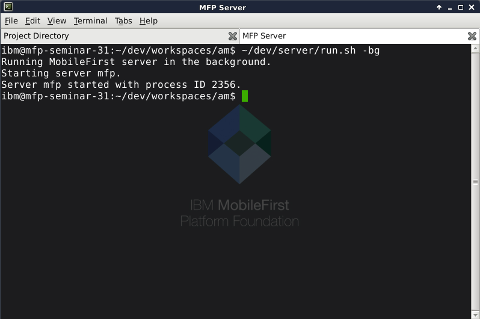
You will see the server start in about 15-20 seconds. *Note: If you are not using the supplied vm image, your server will likely be in a different location.*
7. Click on the Project Directory terminal tab and enter the mobile app project directory like so:  
`cd advancedMessenger`
8. Install npm dependencies into the project by running the command:  
`npm install`  
You should see a tree of dependencies at the end and you may see a few warnings, but don't worry if you do.
9.  Install the Android platform into the Cordova project by entering this command:  
`cordova platform add android`
10.  Install the MobileFirst plugins by entering the following three commands.  
*These plugins are for core MFP functions like security and analytics, offline secure storage, and push notifications, respectively.*  
`cordova plugin add cordova-plugin-mfp`  
`cordova plugin add cordova-plugin-mfp-jsonstore`  
`cordova plugin add cordova-plugin-mfp-push`

11. In the "Project Directory" terminal tab, type the command `gulp build` to rebuild the Ionic project.
12. Enter the following commands to register the app with the MobileFirst Server and propagate the changes to the app:  
`mfpdev app register`  
`cordova prepare`
13.  Open a new tab in the terminal, set its title to **Backend Server**.  Start the backend Node server project by entering the following commands:  
`cd ~/dev/workspaces/am/mockServer`  
`node server.js`  
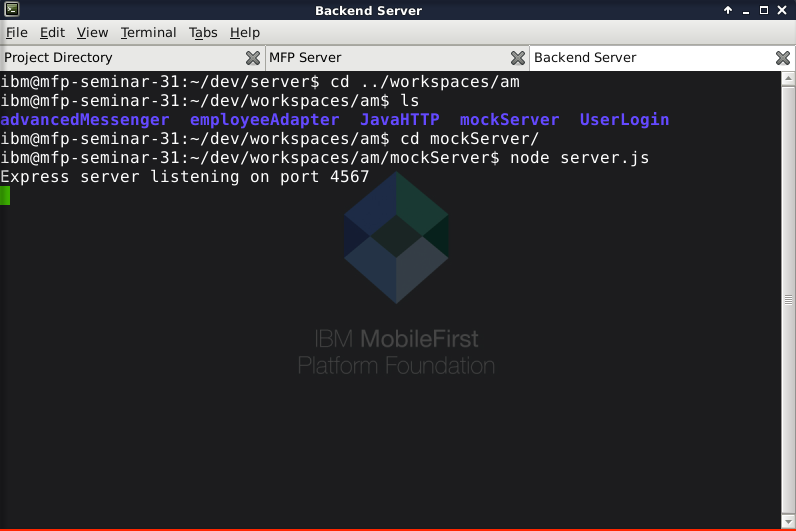
You can test that the mockserver is running by opening up an internet browser window and entering in the url : </br> **localhost:4567/api**  </br>  You should see the message displayed **Mock APIs are running **
14. Now we will need to build and deploy the adapters from lab 2.  *Note: As per the prereqs, if you are not using the supplied lab image, then you must install Apache Maven*.  From a terminal run the following commands to build and deploy the employee adapter:

    ```
    cd ~/dev/workspaces/am/employeeAdapter
    ```
    ```
    mfpdev adapter build
    ```
    On completion you should see the message "Successfully built adapter"
    ```
    mfpdev adapter deploy
    ```
    On completion you should see the message "Successfully deployed adapter"

15. We will repeat this process to deploy our HTTP Java (News) adapter.  From your terminal run the following commands:

    ```
    cd ~/dev/workspaces/am/JavaHTTP
    ```

    ```
    mfpdev adapter build
    ```
    On completion you should see the message "Successfully built adapter"
    ```
    mfpdev adapter deploy
    ```
    On completion you should see the message "Successfully deployed adapter"    
16. Now you can preview your app by typing the following commands from the terminal:

    ```
    cd ~/dev/workspaces/am/advancedMessenger
    mfpdev app preview
    ```
    Select **browser: Simple Browser Rendering** when prompted.
    This should bring up a preview of the app in your browser window
    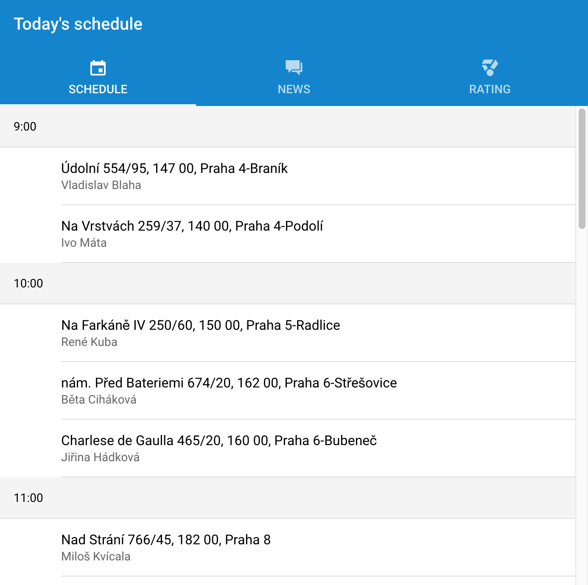
17. Finally we will watch for changes to our app using gulp.  Open another terminal (or terminal tab) and enter the following commands:

    ```
    cd ~/dev/workspaces/am/advancedMessenger
    gulp watch
    ```

#### Introduction

In this lab we will add some security to the adapters that we created and deployed in lab 2. In Part 1 of the lab, we will define a security test that is provided via a sample adapter.  In Part 2 we will map the security test to backend resources that we want to protect.  In Part 3 we will work with our application client-side code that needs to handle the security challenge that our newly-deployed server code returns.  If authentication is successful, then the adapter call to our backend service will run.  

#### Part 1 - Import the UserLogin Adapter Sample Code

1. Open a browser window and open the MobileFirst Operations Console (http://localhost:9080/mfpconsole).  Sign in with the userid/password of admin/admin.  From the lefthand navigation pane, navigate to <b>Download Center -> Samples</b> Scroll down to the bottom and underneath the <b>Security Check Samples</b> header download the <b>User Authentication</b> sample code (named UserLogin.zip).  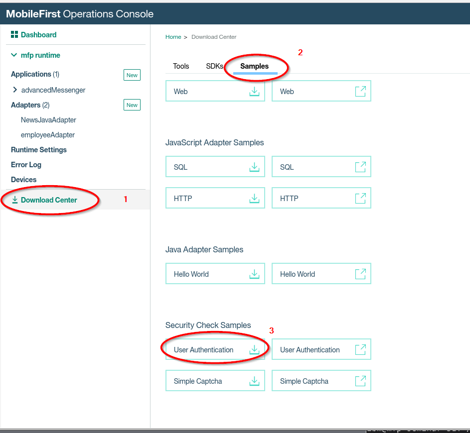
2. From a terminal window, navigate to your ~/Downloads directory and type `unzip  UserLogin.zip` file.  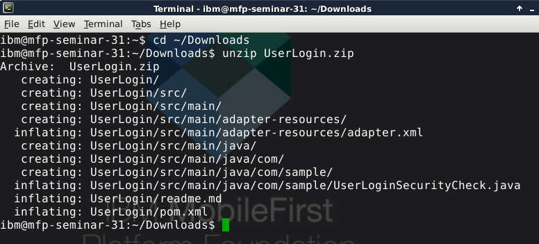
3. From the terminal, move the sample code into our am workspace. </br> `mv UserLogin ../dev/workspaces/am/`
4. This sample code is an MFP adapter, which we will build and deploy on our MobileFirst Server.  From a terminal run the following commands: </br>`cd ~/dev/workspaces/am/UserLogin`</br>`mfpdev adapter build`<br>On completion you should see the message "Successfully built adapter"</b>
5. Now lets deploy the adapter by running the command: </br>`mfpdev adapter deploy`<br>On completion you should see the message "Successfully deployed adapter"
6. Now go back to the MobileFirst Operations Console in your browser and under Adapters you should now see the UserLogin adapter with a lock icon to the left of the adapter title.  (Note, you may need to refresh your browser window to see the adapter).  


 We will take a closer look at this adapter and what it does in Part 2 of the lab.

#### Part 2 - Mapping the UserLogin Security check to adapter procedures

1. Now lets take a look at the UserLogin adapter code.  Open your IDE (eg. VS code, Brackets, etc.) and open the ~/dev/workspaces/am folder.    Now navigate to <b>UserLogin -> src -> main -> java -> com -> sample</b> and open the <b>UserLoginSecurityCheck.java</b> file.   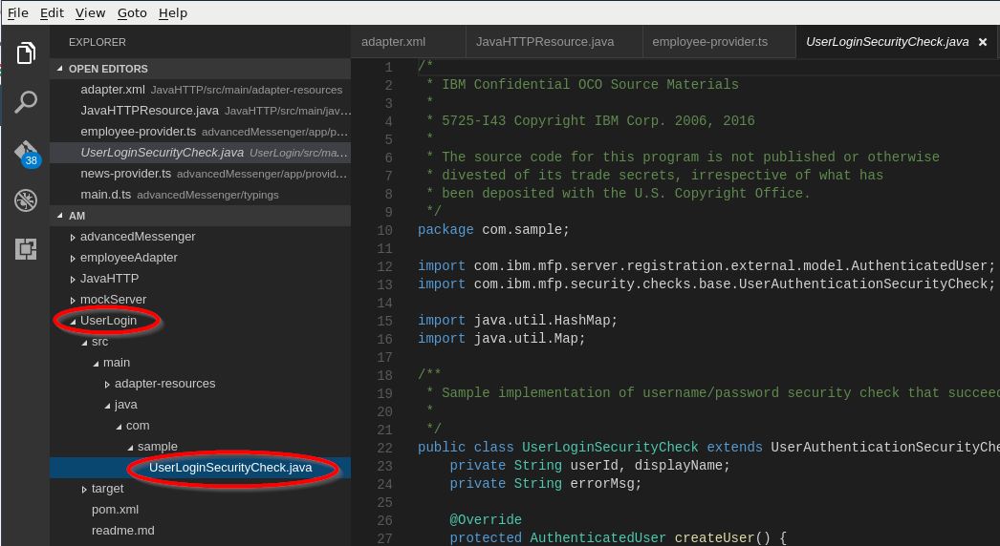

2. Scroll down and look at the **validateCredentials** method at approximately line number 38.   The code checks to make sure that both a username and password are supplied as parameters.  It then checks if the username value equals the password value, then it sets the userId and displayName to the username value and then it returns a true value, otherwise an error message is set and false is returned.  We will apply this security check to "secure" our backend calls.

    ```
    if(username.equals(password)) {
    userId = username;
    displayName = username;
    return true
    } else ...
    ```
3. We can set our application settings to perform security checks when the app attempts to access a protected resource.  From the MobileFirst Operations Console in our browser navigate to **Applications -> advancedMessenger -> Android**  Now click the **Security**  tab.  Scroll down to see the **Scope-Elements Mapping** and **Mandatory Application Scope** sections.   

 *The MobileFirst Foundation platform can protect resources by defining a scope that specifies the required permissions for accessing the resource.   For example you can assign a scope to a Javascript adapter procedure along with the required permissions to invoke that procedure.  You can assign one or more security checks to a scope.   Learn more about scopes here: <a href="https://mobilefirstplatform.ibmcloud.com/tutorials/en/foundation/8.0/authentication-and-security">Authentication and Security</a>. *   

 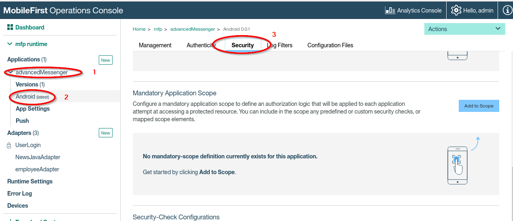  

4. Now we will assign a scope to an adapter procedure that we want to protect.  From your IDE navigate to the</br> **am -> employeeAdapter -> src -> main -> adapter-resources ->** folder and open the **adapter.xml** file.  Now add the scope attribute to the **procedure** tag (at approximately line 26) so it looks like this:  
    ```
        <procedure name="getRating" scope="restrictedData"/>
    ```
    **Save** your changes to the adapter.xml file.
5. Now we need to build and deploy our adapter to from a terminal navigate to the **~/dev/workspaces/am/employeeAdapter** directory.  Run the command: </br> `mfpdev adapter build`  <br>On completion you should see the message "Successfully built adapter"</b>

6. Now we will redeploy the adapter by running the command: </br>`mfpdev adapter deploy`<br>On completion you should see the message "Successfully deployed adapter"

7. Now if we go back to our MobileFirst Operations Console, if we navigate to **adapters -> employeeAdapter ** and look at the ** Resources ** tab, we now see resources secured using the newly defined **restrictedData** scope.  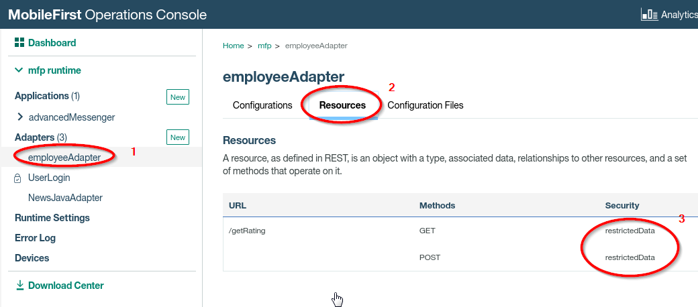
8.  In order to use our newly created restrictedData scope, we need to perform a mapping from the securityData scope to the UserLogin security check.  From the MobileFirst Operations Console, left navigation pane, navigate to **Applications -> advancedMessenger -> Android** and then click on the **Security** tab.   Navigate to the **Scope-Elements Mapping** section and click on the **New** button.  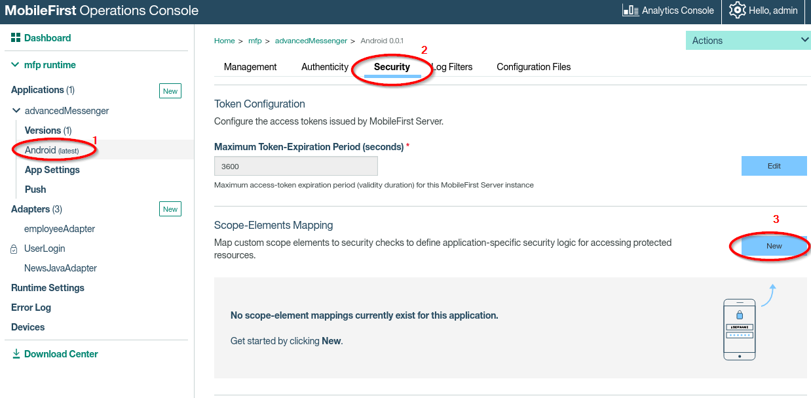
9. In the **Add New Scope-Element Mapping** panel that opens up, set the **Scope element** input field to **restrictedData**.  Click the **UserLogin** button under the **Custom Security Checks** heading and click the *Add** button.  This will map the custom UserLogin to the restrictedData scope that we just defined and applied to our Javascript adapter procedure.  
	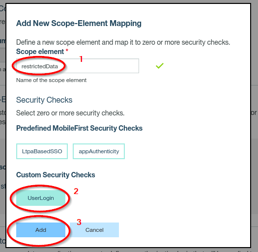

10.  Now we will take a similar approach to apply the UserLogin security check to a scope associated with a method in our "News" Java adapter using the OAuthSecurity annotation.  From your IDE (eg. VS Code), navigate to **am -> JavaHTTP -> src -> main -> java -> com -> sample -> JavaHTTPResource.java**

11. First we need to add OAuthSecurity to our java imports.  Add the following import statement to JavaHTTPResource.java.

    ```
    import com.ibm.mfp.adapter.api.OAuthSecurity;
    ```
    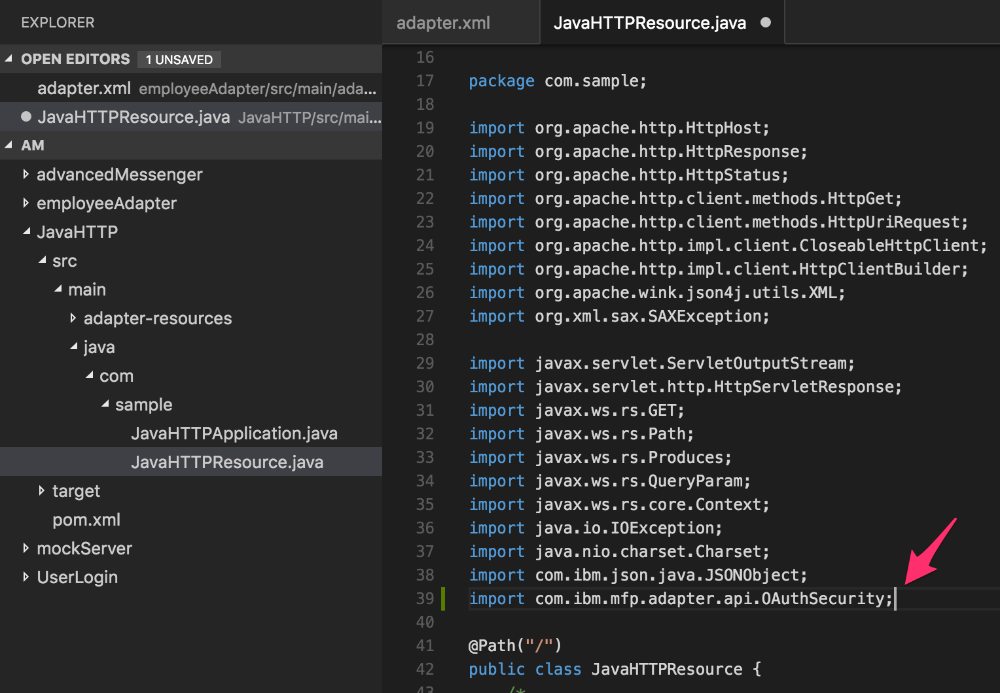

12. Now we can use the OAuthSecurity annotation in the JavaHTTPResource class, scroll down to the **get** method (approximately line 78).  Prior to the method declaration, add the OAuthSecurity annotation to associate the restrictedData scope to the get method:

    ```
    @OAuthSecurity(scope="restrictedData")
    ```
    Your code should look similar to this:

    ```
    @GET
    @Produces("application/json")
    @OAuthSecurity(scope="restrictedData")
    public void get(@Context HttpServletResponse response)
    throws IOException, IllegalStateException, SAXException {...
    ```

    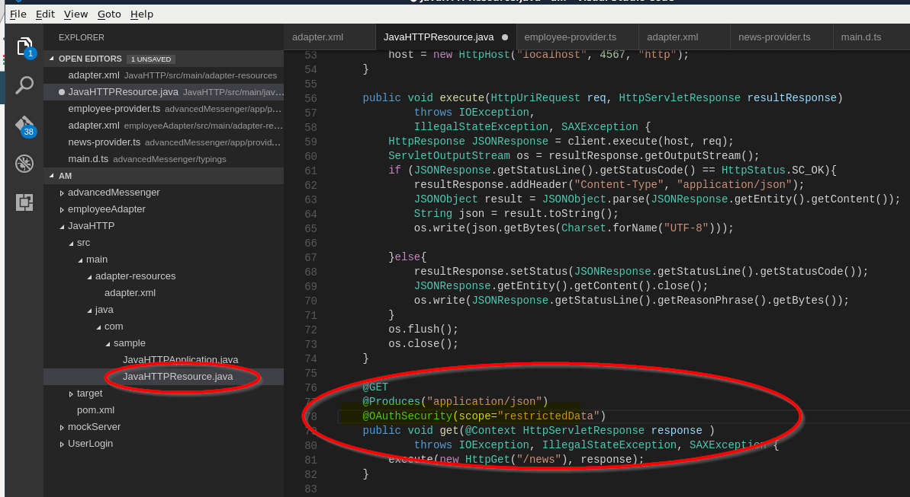
    **Save your changes.**
13.  Now we will build and deploy our modified java adapter.  From a terminal, navigate to **~/dev/workspaces/am/JavaHTTP** and run the command: </br> `mfpdev adapter build` </br> You should see the message **Successfully built adapter**  Now deploy the adapter by running the command: </br> `mpfdev adapter deploy` </br>   You should see the message **Successfully deployed adapter**
14.  Now from the MobileFirst Operations Console you can navigate to **Adapters -> NewsJavaAdapter** and click on the **Resources** tab.  You should see the **restrictedData** scope associated with the **GET** method.  *Note that we already have mapped the restrictedData scope to our UserLogin security check, so we won't have to repeat that step here.*  We now have mapped our UserLogin security check to the restrictedData scope which is securing backend calls in both our Javascript and Java adapters.   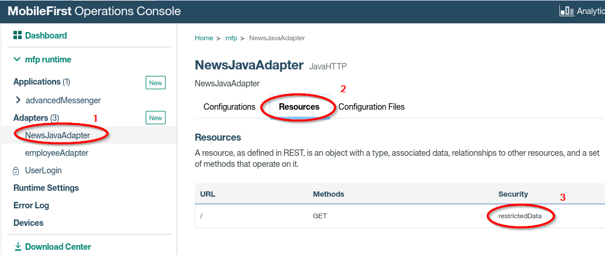

#### Part 3 - Working with the Client Side Code.

Now we need to write the client side challenge handler code which will handle the UserLogin security check, grabbing the credentials provided by the user and returning those to the server side security check adapter.  If the user credentials are accepted then our initial call to our backend adapter will be executed; otherwise, the client side challenge handler will again prompt the user for credentials.  Recall that the UserLogin adapter checks incoming credentials to see if the value of the username is equal to the value of the password. Code snippets will be provided to help with code editing. Let's get started with the client side code.

1. From our IDE navigate to **am -> advancedMessenger** and open **app.ts**.  At the bottom of the **MyApp** class following the **MFPInitComplete()** function  create a new function called **AuthInit()** and add a call to AuthInit from inside **MFPInitComplete**.  (You can cut and paste  snippet01). AuthInit will create our security challenge handler.  Your modified code for the MFPInitComplete() function and for the AuthInit() function should look like this:

    ```
    MFPInitComplete(){
    console.log('--> MFPInitComplete function called');
    this.rootPage = TabsPage;
    this.AuthInit(); //Here is our new call to AuthInit
    }

    AuthInit(){

    }
    ```
    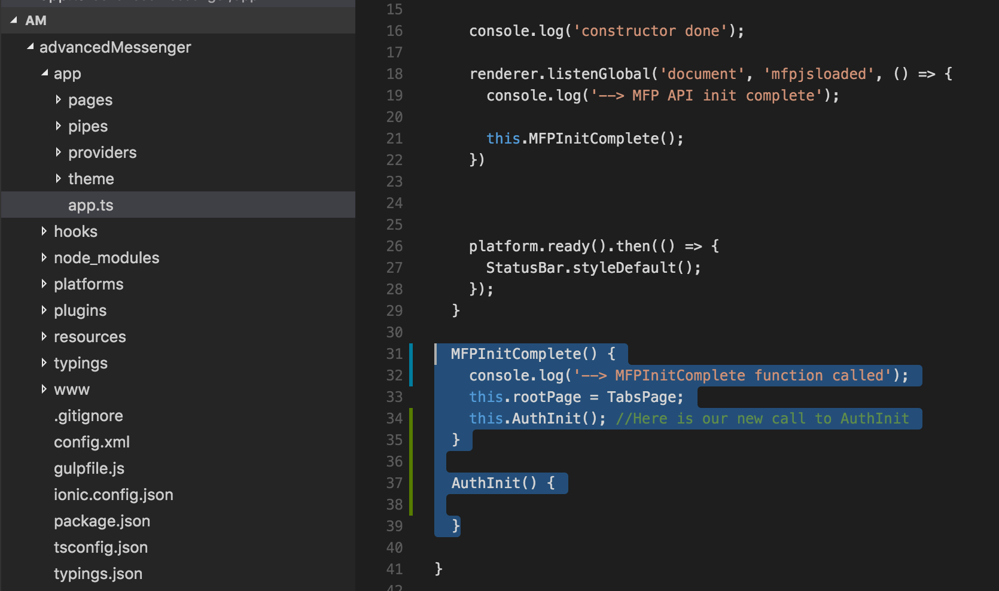
2.  Now we need to declare the AuthHandler variable that we will use inside the MyApp Class.   Underneath the **private rootPage:any;** declaration (approximately line 12, at the top of the class) add the following line:

    ```
    private AuthHandler: any;
    ```
    your code should now look like this:

    ```
    export class MyApp {
      private rootPage:any;
      private AuthHandler: any;

    ```
    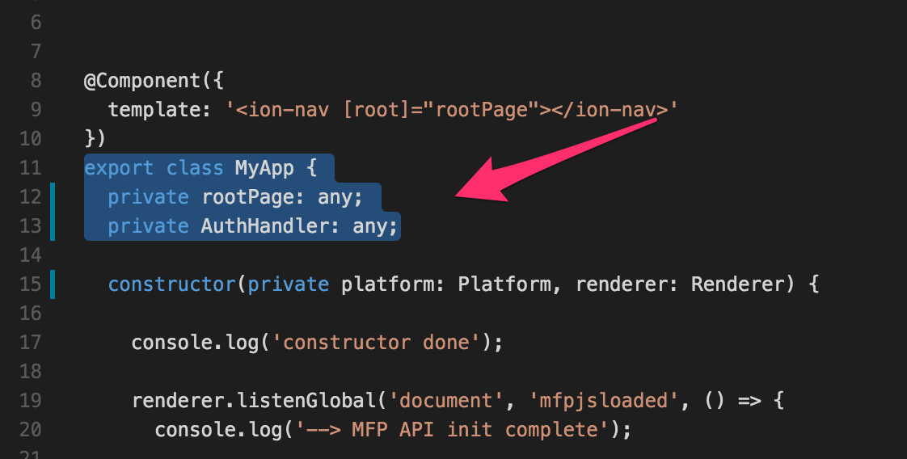  

3.  Now we will set our newly created AuthHandler variable to our security challenge handler.  In our newly created AuthInit function modify the function to look like this (snippet02):

    ```
    AuthInit(){
      this.AuthHandler = WL.Client.createSecurityCheckChallengeHandler("UserLogin");
      this.AuthHandler.handleChallenge = ((response) => {
        //handle success
        console.log('--> Inside handleChallenge');
        this.displayLogin(); //display Ionic2 login alert which we will define in next step
      })
    } //end of AuthInit
    ```

    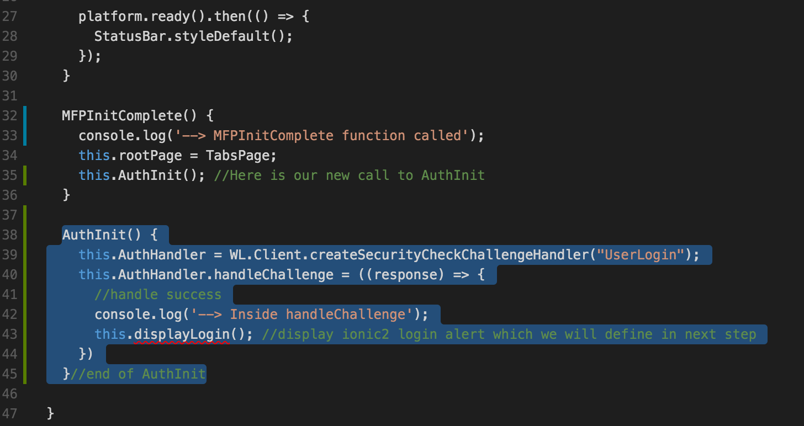

    Notice that we used UserLogin, (our previously defined security check) when we create the AuthHandler.

4. When we handle the security challenge we are calling the displayLogin function, which we have yet to define.  Let's create that function.  Underneath your newly created AuthInit function add our new displayLogin() function (snippet3):

    ```
    displayLogin(){
      //start with some Ionic2 alert sample code here    
      let prompt = Alert.create({
        title: 'Login',
        message: "Enter your login information here",
        inputs: [
          {
	         name: 'username',
	         placeholder: 'Username'
	       },
	       {
	         name: 'password,
	         placeholder: 'Password',
	         type: 'password'
	       }],
        buttons: [
          {
            text: 'Login',
            handler: data => {
              console.log('--> Trying to auth with user', data.username);
              this.AuthHandler.submitChallengeAnswer(data);
            }
          }]
      });
    }//end of displayLogin
    ```

    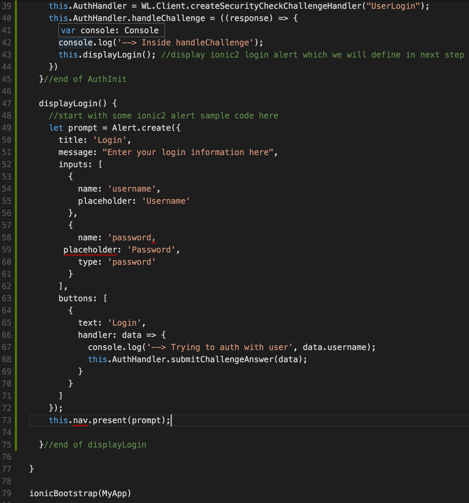

    In our code we are creating an Ionic2 alert with two input fields, a username input and a password input.   We have one login (submit) button.  The button code contais the handler that submits our credentials data.

5.  The displayLogin function is using the Ionic2 Alerts component and assigns it to the prompt variable.  

 *An Alert component is similar to a popup screen that floats on top of an existing view.  You can read more about Alerts here: <a href="http://Ionicframework.com/docs/v2/components/#alert">http://Ionicframework.com/docs/v2/components/#alert</a>.*

 In order to use Ionic2 alerts we need to modify line 2 of the app.ts file and change the import statement from:

    ```
    import {Platform, IonicBootstrap} from 'Ionic-Angular';
    ```
    to

    ```
    import {Platform, Alert, IonicBootstrap} from 'Ionic-Angular';
    ```
    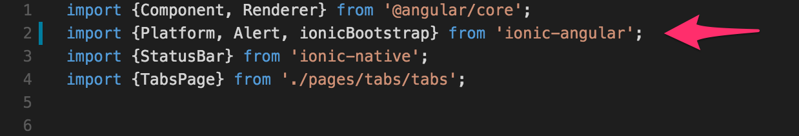

7.  In the DisplayLogin function we added the **this.nav.present(prompt)** to our app.   We will need to add some additional code to work with **nav**.  First we will add a reference to the Ionic2 **App** Utility Service which will be used to get the current Ionic nav.  We will then assign the current Ionic nav to the **nav** variable.  Start by modifying the import statement on line 2 of the app.ts file.  Change the line from:

    ```
    import {Platform, Alert, IonicBootstrap} from 'Ionic-Angular';
    ```
    to

    ```
    import {Platform, Alert, App, IonicBootstrap} from 'Ionic-Angular';
    ```
8. Now add the **App** service to our class constructor (approximately line 15).  Change the line from:

    ```
    constructor(private platform:Platform, renderer:Renderer){
    ```
    to

    ```
    constructor(private platform:Platform, renderer:Renderer, private app:App ){
    ```
    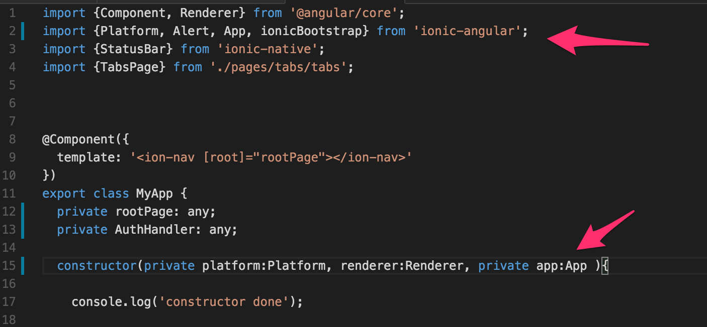

9.  Now we can use this Ionic **app** utility service to get the active Ionic nav. We will work with application lifecycle events to trigger when we get the active nav.  The nav controller will be loaded after the view init event.  Since this is an Ionic2/Angular2 app we will use the Angular2 lifecycle hook **ngAfterViewInit()**. Using this hook we set the **nav** variable to the active nav after our component view has been initialized.  To do this, add the **ngAfterViewInit()** hook right above the **MFPInitComplete()** function and set this.nav to our active nav.  It should look like this (snippet04):

    ```
    ngAfterViewInit(){
      this.nav = this.app.getActiveNav();
    }
    MFPInitComplete(){
    ```
    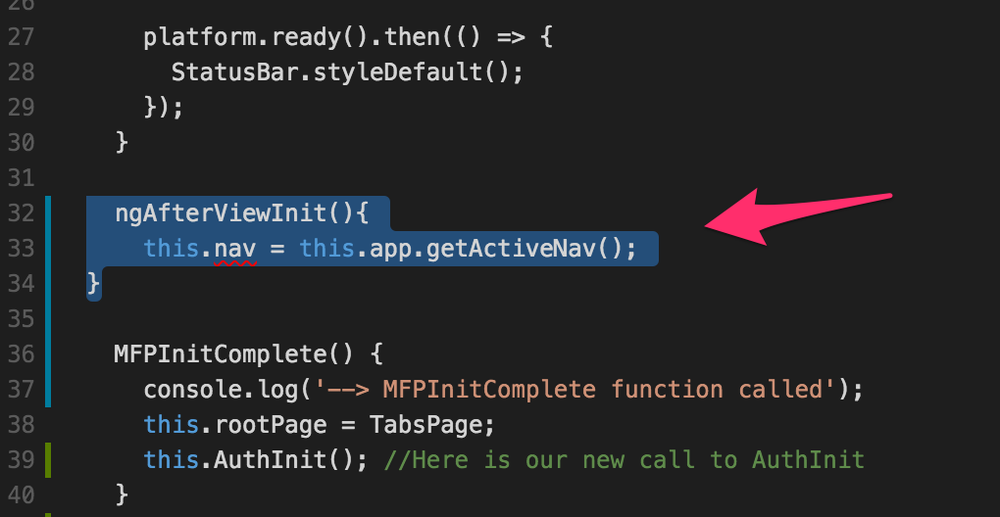

10. Since we are referencing this.nav to contain our current Ionic nav we need to declare it as a variable.  At the top of the **MyApp** class add the **nav** variable declaration so it looks like this:

    ```
    export classMyApp {
     private rootPage:any;
     private AuthHandler: any;
     private nav: any;

    ```
    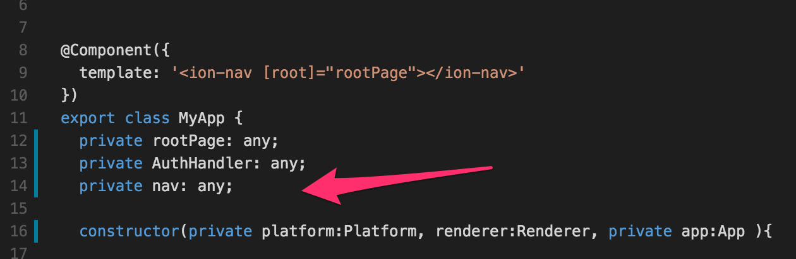
    **Save** all your changes.  We now should have a working security challenge handler!

11. Before testing our code, we still need to make another modification to our app.  In our code, we currently are pointing to localhost in a sample code call to our mock service.  In order for this to work properly on a device we need to edit this call to point to our machine's IP address.  First we will need to get the primary IP address for your machine.  Open a terminal window or tab and enter the following command to obtain and copy the primary ip address:
`/sbin/ifconfig | more`

	and find the inet addr field for your primary (eg. eth0) adapter.  (eg. 192.168.123.456) *Note: Your IP Address will likely be different*.

	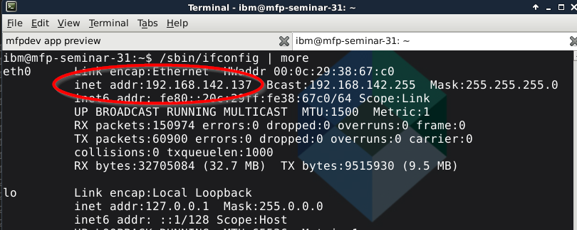

12. Now we will point the ScheduleProvider class to your ip, navigate to **am -> advancedMessenger -> app -> providers -> schedule-provider** and edit the **schedule-provider.ts** file.  Navigate to approximately line 32 and change the line from:

    ```
    this.http.get('http://localhost:4567/schedule')
    ```
    to

    ```
    this.http.get('http://yourIPAddress:4567/schedule)
    ```
    where **yourIPAddress** will be the ip address from the previous ifconfig command.  **Save** your changes.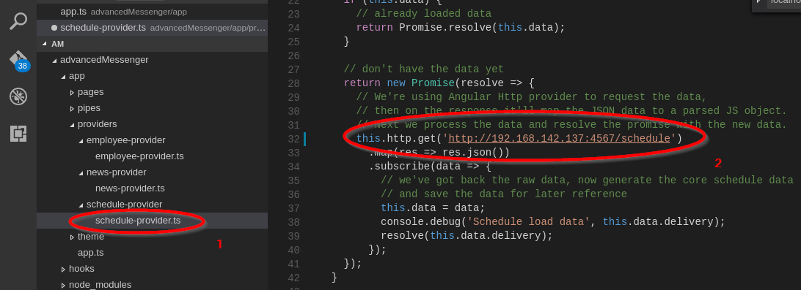


#### Part 4 - Testing our Changes

So far we have defined a security check using MobileFirst Platform Foundation adapters and we have added code to our client-side app to handle the security challenge.  Now it's time to test our changes.

1. From a terminal window, navigate to **/dev/workspaces/am/advancedMessenger** and start an Android virtual device by typing the command:
`android avd` </br>
*Note: if you are using the lab provided virtual machine, then a Nexus 4 virtual device should be defined.*  Select this device and click **Start..** to start the virtual device. Select **Scale display to real size.** Take the rest of the default options and **launch** the virtual device.  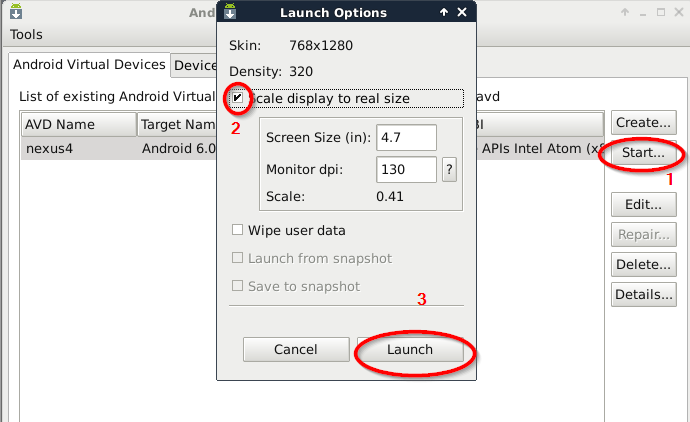  *Note: **Android virtual machines may take a few minutes to start up, so this may be a good opportunity to grab a coffee :-)***
2. Now we are going to launch the app on the virtual android device.  Open a new terminal or terminal tab and navigate to **/dev/workspaces/am/advancedMessenger**.  From this directory enter the command:
`cordova run android`.   

 *Note: **This again may take several minutes, so this may be a good opportunity to grab a donut**.*  

  When the app comes up you should see the following screen: 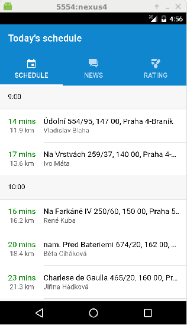
3. Now let's test our security challenge.  From your app running on the Android virtual device, click on the **NEWS** tab. </br>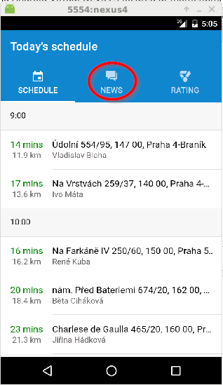</br>  You should now see the security challenge handler that we defined.  Type in a userid and password where both are set to the same value (eg. admin/admin) and click **LOGIN**.  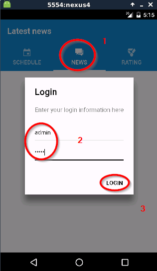  
4.  You should now see the results from the call to our protected NEWS adapter.  You can also test going to the RATING tab, where you also should now be prompted for a userid and password as part of our defined security challenge.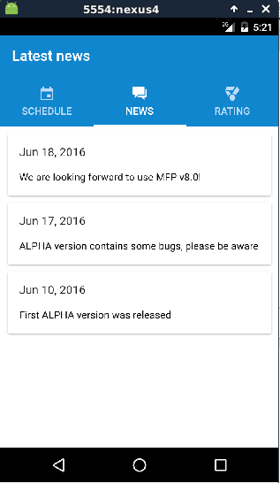

</br> **Congratulations!**, you have completed the Securing Backend Calls with MobileFirst lab.  You can see how the resource security model is easy to use in MobileFirst.  This extends into more sophisticated use cases such as social login, enterprise directory login, and step-up authentication scenarios.

*For more tutorials on authentication and security, check out the MobileFirst Foundation Developer Center: [https://mobilefirstplatform.ibmcloud.com/tutorials/en/foundation/8.0/authentication-and-security/](https://mobilefirstplatform.ibmcloud.com/tutorials/en/foundation/8.0/authentication-and-security/)*
