### Lab 4: Mobile Foundation V8 Push Notification Lab

In this lab, we will continue with the application we have been building and now add the ability to register and subscribe to push notifications.  The MobileFirst Server makes it easy to configure your credentials for Apple, Google, and Windows push notifications, set up tags for your application, and then test push notifications being sent to the app.  You will find this is easy to use and test with in development, and in production use cases you can send push notifications easily via the REST API calling push endpoints on MobileFirst Server.

### Lab Setup

If you completed all the previous labs to this point, then you can safely skip this section.  If however you are starting with this lab, you need to complete these setup steps so that you can work through this lab.  Let's proceed.

1.  Start the lab virtual machine and log in with username **ibm** and password **QQqq1234**.
2. Open a terminal window by clicking the icon on bottom left.  Set the terminal title by clicking *Terminal-Set Title* and naming it **Project Directory**.
3. Navigate to this directory by typing in the command
`cd ~/dev/workspaces`
4. Create a working directory for this lab by typing `mkdir am` and then change into this directory by typing `cd am`.
5. We will pull in the code needed for the lab now.  Type the following commands into the terminal.  
`git init`  
`git remote add origin https://github.com/andriivasylchenko/advancedMessenger`  
`git pull origin lab2.64`
6.  Open a second terminal tab where we will start our MFP Dev Server.  Set the terminal title by clicking *Terminal-Set Title* and naming it **MFP Server**.  Type the following commands.  
`~/dev/server/run.sh -bg`  
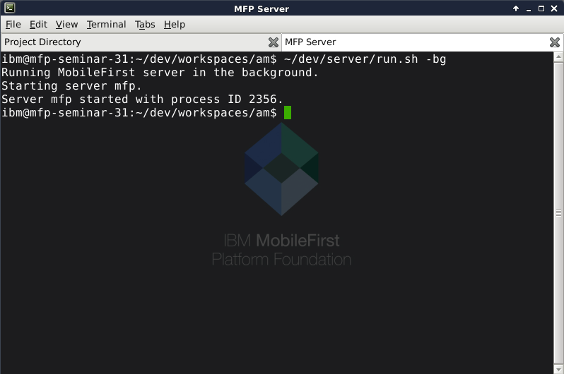
You will see the server start in about 15-20 seconds.
7. Click on the Project Directory terminal tab and enter the mobile app project directory like so:  
`cd advancedMessenger`
8. Install npm dependencies into the project by running the command:  
`npm install`  
You should see a tree of dependencies at the end and you may see a few warnings, but don't worry if you do.
9.  Install the Android platform into the Cordova project by entering this command:  
`cordova platform add android`
9.  Install the MobileFirst plugins by entering the following three commands.  
*These plugins are for core MFP functions like security and analytics, offline secure storage, and push notifications, respectively.*  
`cordova plugin add cordova-plugin-mfp`  
`cordova plugin add cordova-plugin-mfp-jsonstore`  
`cordova plugin add cordova-plugin-mfp-push`
9. Configure your app to use the host IP address.  Enter the command`/sbin/ifconfig | more`
</br> and find the inet addr field for your primary (eg. eth0) adapter.  (eg. 192.168.123.456) *Note: Your IP Address will likely be different*.  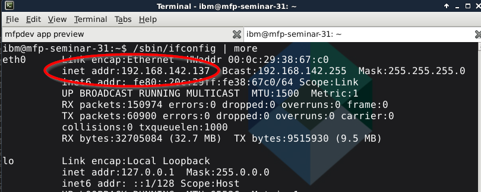

12.  Now we will point the ScheduleProvider class to your ip.  Open VS Code (Menu -> Development) or your editor of choice.  With your editor, open the folder **~/dev/workspaces/am**.  Navigate to **AM -> advancedMessenger -> app -> providers -> schedule-provider and edit the **schedule-provider.ts** file.    Navigate to approximately line 32 and change the line from:

    ```
    this.http.get('http://192.168.42.169:4567/schedule')
    ```
    to

    ```
    this.http.get('http://yourIPAddress:4567/schedule)
    ```
    where **yourIPAddress** will be the ip address from the previous ifconfig command.  **Save** your changes.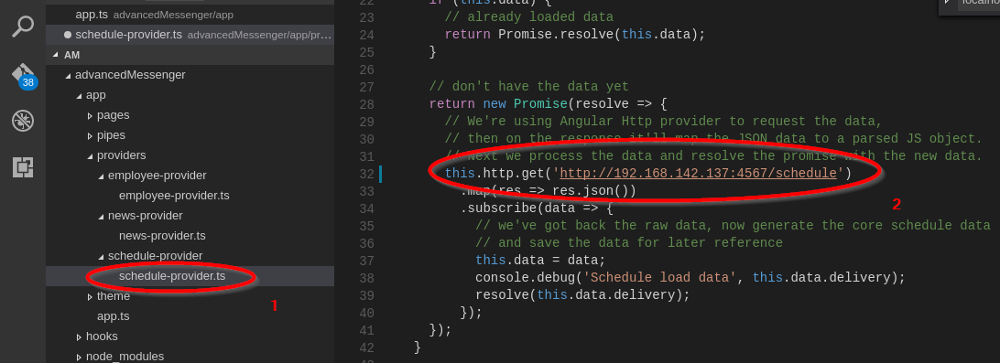

11. In the "Project Directory" terminal tab, type the command `gulp build` to rebuild the Ionic project.
9. Enter the following commands to register the app with the MobileFirst Server and propagate the changes to the app:  
    `mfpdev app register`  
    `cordova prepare`
10.  Open a new tab in the terminal, set its title to **Backend Server**.  Start the backend Node server project by entering the following commands:  
`cd ~/dev/workspaces/am/mockServer`  
`node server.js`  
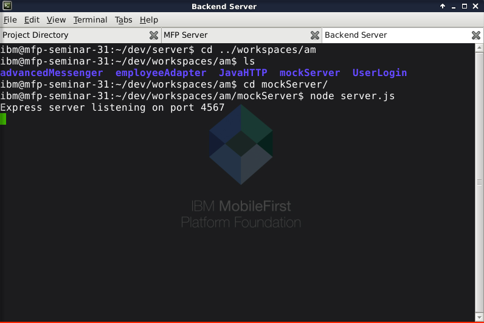
11. We will now deploy several artifacts to the MobileFirst Server.  *NOTE: These artifacts may already be deployed if you have completed earlier labs 1,2 & 3.*  Open the web browser and type in http://localhost:9080/mfpconsole and log in with admin/admin.
12. Click on the Adapters link on the left where we will deploy three adapters, of which two are mobile API's and one is a security adapter for authentication.  
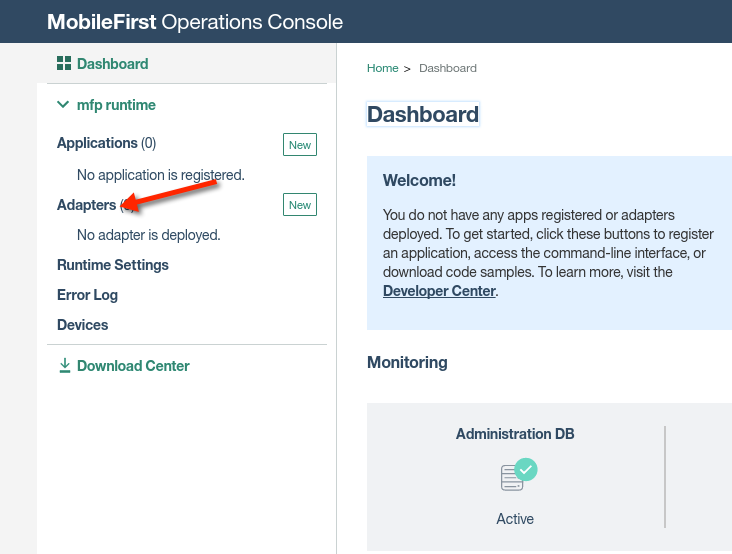
15.  Click on the Actions on the right and choose **Deploy Adapter** as shown:  
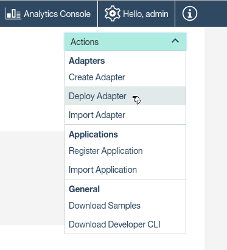
16. Browse and select the following adapter file and click Open:  
`am/employeeAdapter/target/employeeAdapter.adapter`  
Click the Deploy button to deploy the adapter.
17.  Repeat the previous instruction and deploy the following two adapter files:  
`am/JavaHTTP/target/JavaHTTP.adapter`  
`am/UserLogin/target/UserLogin.adapter`
18. Finally, we will map our security scope element to our security check.  You should see a single entry in **Applications** called *advancedMessenger* and underneath it a single version for *Android* - click on the word *Android* to configure this version.
19. Click on the *Security* tab at the top and look for the *Scope-Elements Mapping* section and click the **New** button.
20. In the popup, type in **restrictedData** and click on the **UserLogin** button under Custom Security Checks and then click Add as shown.  
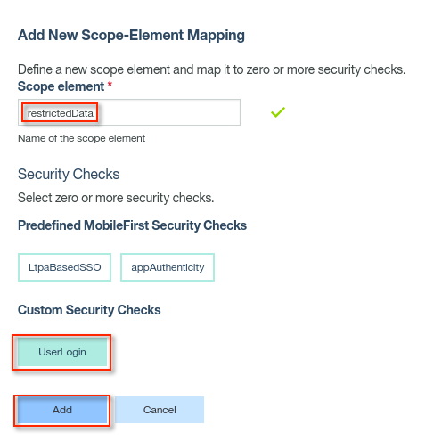  
You should see a message at the top indicated *the application descriptor was saved successfully*.

### Lab Start

1. We will start by making a small but important setting change to select a certain version of Google Cloud Messaging to use for this lab.  This is to work around a bug in GCM so that it will work well with the Android emulator in our lab environment.  Open VS Code editor at bottom left, and open the file `advancedMessenger/platforms/android/project.properties`.
2. The last entry is the one we need to change, from `com.google.android.play-services-gcm:+` to `com.google.android.play-services-gcm:9.0.2`.  Save the file after the change.
3. Now we will launch our Android emulator for our testing later.  In a new terminal tab type `android avd` and you will see the AVD Manager open.  Click on the "nexus4" AVD and click **Start** and in the next window click "Scale display to real size" and then **Launch**.  This will take a minute or two to start completely - you will see the home screen of the Android virtual device when it is completely started.

### Set up Google Cloud Messaging

In this section we will configure a Google Android project with Google Cloud Messaging and configure the MFP Server to use these project credentials for Android push notifications.

5. Open a tab in your browser to the MFP Operations Console [http://localhost:9080/mfpconsole](http://localhost:9080/mfpconsole) logging in with admin/admin.  Expand the **advancedMessenger** project and click on *Android (latest)*.
6. Now we need to obtain a Google API key for sending push notifications to Android devices.  Navigate to the following URL in a new browser tab and log in with your Google username and password:  [https://console.firebase.google.com](https://console.firebase.google.com)
7. Once you are logged in, click on the button to create a new project named **advancedMessenger** like so:  
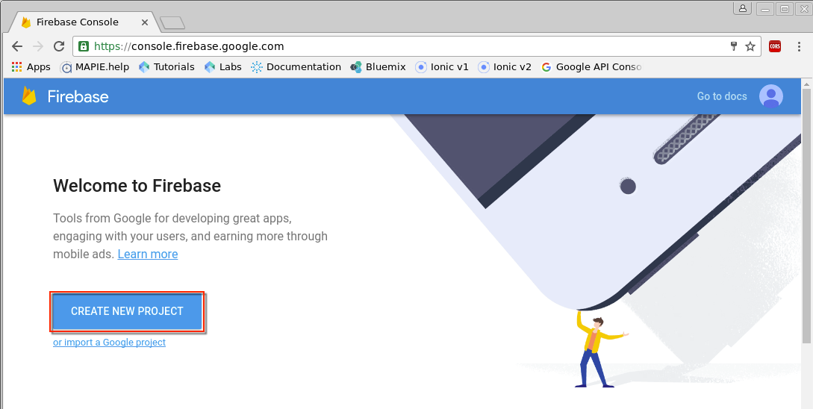</br>
</br>
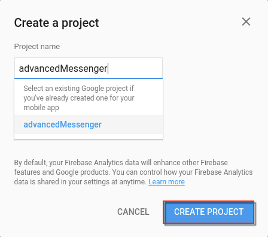.  
Wait about 30 seconds until project is created.
8.  In the upper left, click on the gear icon and click on **Project Settings**. You will see a screen like the following with Server Key and Sender ID.  Copy the Sender ID with Ctrl-C.
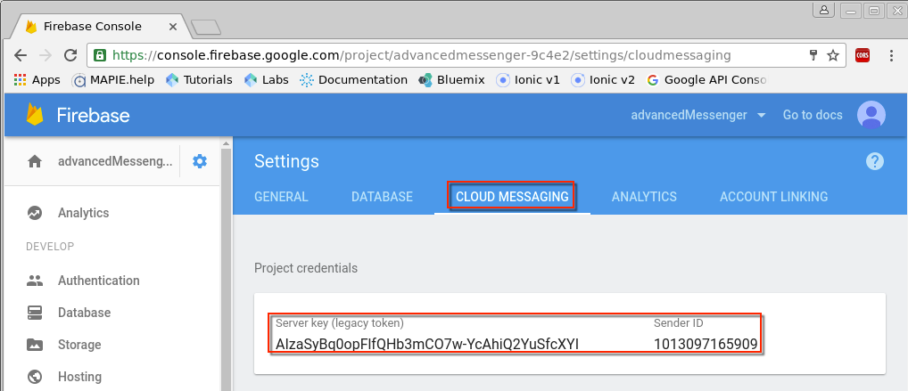
9. Switch back to the MFP Console browser tab.  Navigate under the **advancedMessenger** application to Push and the Push Settings tab.  Scroll to GCM Push Credentials and paste the Sender ID as shown.  Repeat for the Server API Key and click **Save**.  You will see a message at the top indicating *The GCM Credentials were saved successfully*.
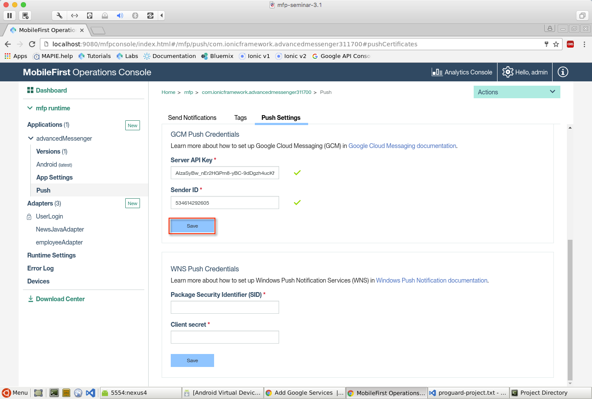
10. We will now set up a push tag so that notifications can be sent to any mobile clients that register for push notifications with our tag, such as our mobile app.  Click on the Tags tab, then click on the **New** button.  Provide a Tag name of **am** and a description like **test tag** and click **Save**.  
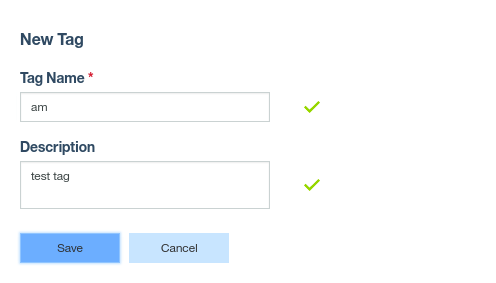
11. Next, we will set up a security scope element mapping to allow our application to register for push notifications.  On the left, click under *Android(latest)* under advancedMessenger to edit app properties, and then click on the Security tab.
12. In the Scope-Elements Mapping section, click on **New** to create one.  Enter *push.mobileclient* and click the **Add** button, which will create a scope element with no security checks to allow our mobile app to register for push notifications.  
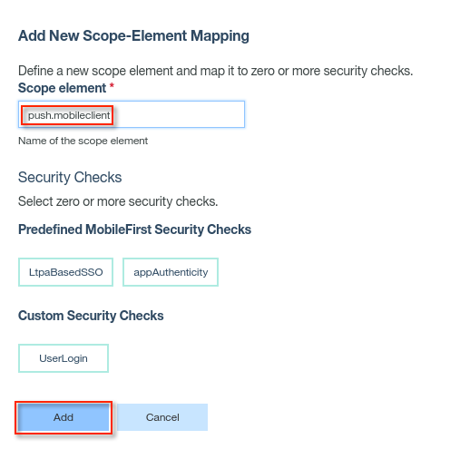

## Enhance App for Push with Client SDK

In this section, we will enhance the app by adding a new Angular provider to handle the push messaging registration and tag subscription functions, and integrate this new provider into our mobile app.  To complete this section, you can type the code directly or copy the snippets from our code snippets file.  You can refer to the final screenshots to verify your code insertions.

### Modify app.ts for new PushProvider provider

We will start by modifying our main app file to refer to the push provider that we will create in the following steps.
2. Return to the VS Code editor and open the `advancedMessenger\app\app.ts` file.  
In the imports section at top, add the following line to refer to our new push provider:  
`import {PushProvider} from './providers/push-provider/push-provider';`
3. Add the following in the *@Component* section right after the template entry - first a comma, and then the following line:  
`providers: [PushProvider]`
3. Locate the constructor and insert first a comma and space and then the following text before the ending parenthesis,
`private push: PushProvider`.
4. Now we will add code to initialize the push provider at app startup.  Navigate down to the *MFPInitComplete()* method and insert the following line of code right after *this.rootPage=TabsPage;* and before  *this.AuthInit();*  
`this.push.init();`
5. The app.ts file should look like the following with the previous four code additions shown:  
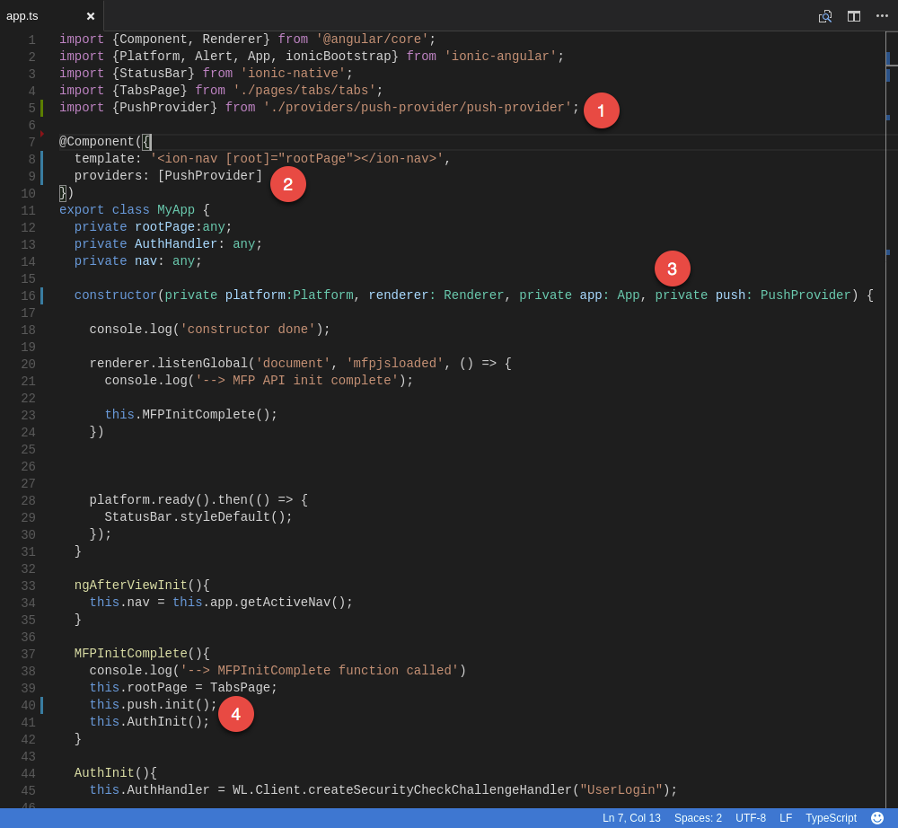
6. Once you've confirmed your additions, save and close the app.ts file.

### Generate and implement PushProvider

Now we will actually implement the PushProvider provider that we referred to in the previous step.  The MobileFirst client Push API is simple to use and powerful.  At a basic level, the progression is this.  First, initialize the push SDK.  Then register the device for push notifications, which calls into the MFP Server and registers the device details in the MFP server backing database that manages registered devices for push.  Then subscribe to push notifications, often using a tag or tags to define which notifications are desired.  Easy, right?  Let's show you how it's done.

1. Return to the console (terminal window) and open the **Project Directory** terminal tab.
2. Type the following command to generate a new provider called PushProvider:  
`ionic g provider PushProvider`  
You will notice when you switch back to VS Code that a new folder can been created under the *providers* folder and a new *push-provider.ts* file.
3. Copy and paste the **entire** contents of the push-provider.ts file with the section for this step from the lab snippet file, and then save the file.  We will describe in detail what each piece of code is doing based on the following annotated screenshot:  
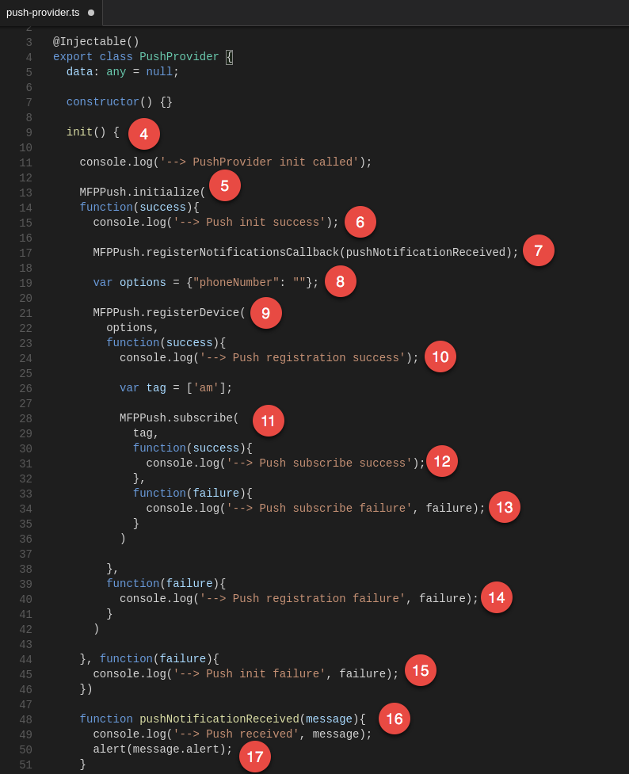
4. This is the *init()* method which was called in changes made to the *app.ts* file in the last section.
5. Here is the initial call in the MFP push client protocol, which initializes the push interaction with the MFP Server, and contains callbacks for both success and failure of this operation.
6. If *MFPPush.initialize()* succeeded, the console will log a success message.
7. Since successfully initialized, the code now registers a callback function, defined below, which will respond to push notifications received.
8. This line sets up an *options* variable we will use when we register the device for push notifications.  This is a mandatory parameter when calling the *registerDevice* method, and can include many important items such as badge, sound, badge icons, and interactive notification details, depending on device.  We simply provide the *phoneNumber* item here as part of our *options* variable.
9. This call registers the device with the MFP Server for push notifications, and contains callbacks for both success and failure of this operation.
10. In the success callback, a console message is written indicating successful registration.  Also, a variable is initialized for an array of tags containing a single element, the "am" push tag we set up earlier, which we will use next when we subscribe.
11. Here is the call to subscribe to push notifications, using the *tag* parameter containing an array of tags, and this method will provide callbacks for success and failure.
12. In the success callback, a message is written to the console log indicating successful subscription.
13. In this failure callback, a console message is written indicating a failure in subscription with the failure message.
14. In this failure callback, a console message is written indicating a failure in registration with the failure message.
15. In this failure callback, a console message is written indicating a failure in initialization with the failure message.
16. Here is the key function that we defined earlier which responds to a push notification being received and defines what action to take in response.
17. Once the push notification is received, a message is written to the console indicating a message was received, and an alert window is opened in the app showing the **alert** part of the message.

### Deploy and test application with push notifications

We are now ready to build and test the application.  We will test the application both in the foreground and in the background to ensure both are working as they should be.

1. Open the "Project Directory" terminal tab, and type the following text to rebuild the application:  
`gulp build`  
The app should build successfully, and you should have no compilation errors at this stage.  If you do, check the code listings for *app.ts* and *push-provider.ts*.
2. Type the following command into the terminal:  
`cordova emulate android`  
Since you started the Android emulator earlier, it should take 30-60 seconds or so for the build to run and deploy to the emulator.  You will see the app appear on your emulator.
2. Open another Chrome browser tab and enter the following:  
`chrome://inspect/#devices`  
You should see an entry for our Android Virtual Device and a link called **inspect**.  We will click this so that Chrome attaches to it and we are able to monitor the progress of the running application, including logs.  Click the link now, and a window will appear mirroring the application and showing the console log on the right.  
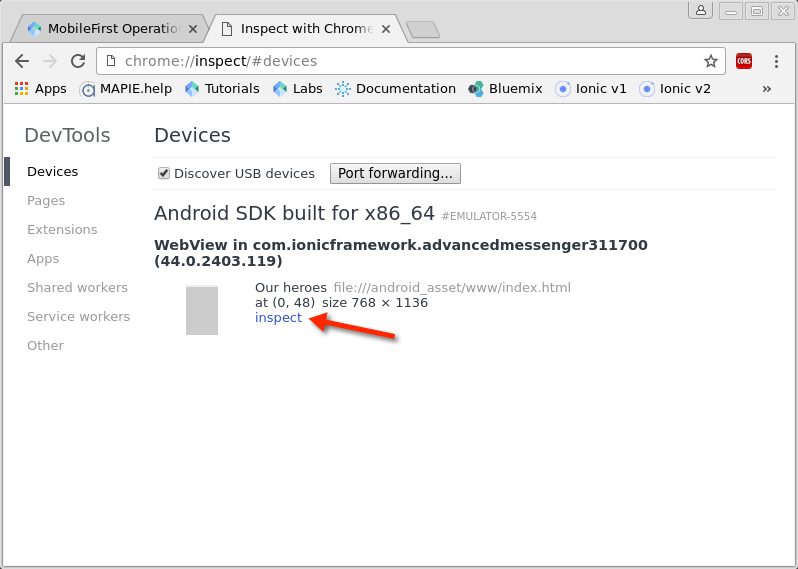
3. The app should be showing schedule data on the Schedule tab and challenge for a user login when you click on the News or Rating tabs.  You can login with any username and password that are identical.
4. You may have noticed if you were watching the Inspector window that there were several log entries related to push.  You should see the following entries, indicating all three steps in the push protocol have been successful:  
`Push init success`  
`Push registration success`  
`Push subscribe success`
5. Now we can test push notifications.  Switch back to the MFP Operations Console in your browser tab.  Click the Push section under the **advancedMessenger** application, then click on *Send Notifications*.
6. In the Push window, choose Send To - *Devices by Tags*, Tag Name - *am*, and enter Notification Text of your choice, then click the **Send** button.  
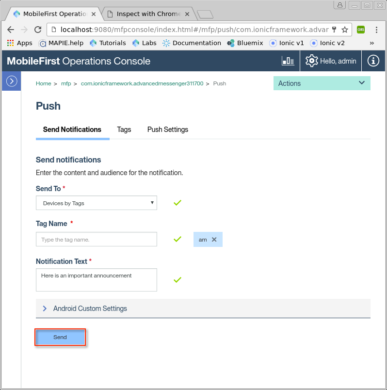
7. If successful, you will see the push notification message appear in the Android Virtual Device window, as well as a console log entry in the Inspector browser window.  Success!  
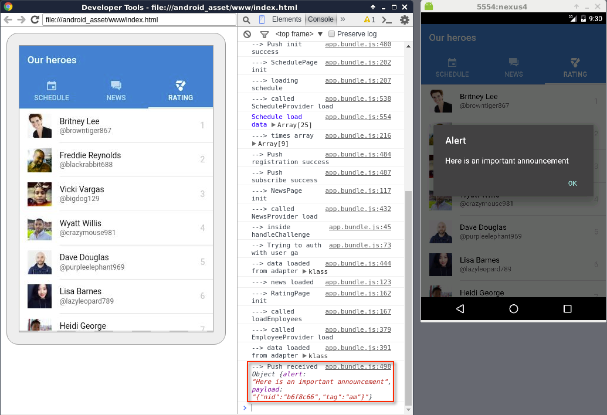
8. Now let's test and make sure that we get the notification when the app is not running at all, as should be the case.  Hit the square icon at the bottom in the Android Virtual Device.  
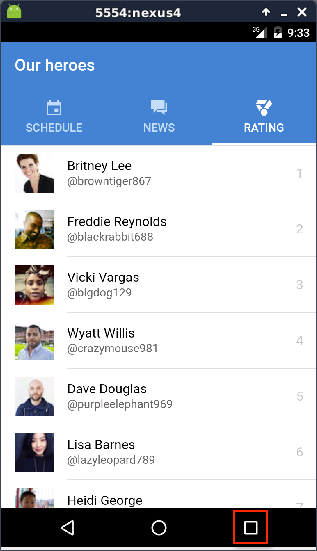  
Next, hit the X to kill the advancedMessenger application.  
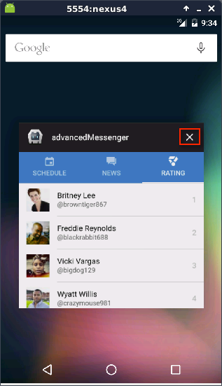  
This will unload the app from memory completely and you will be disconnected from the app in the Inspector browser window, since it is no longer running the app.  
9. Go back to the MFP Operations Console in the browser tab and send another notification as in the earlier step.  This time send a different notification message such as "Testing with application offline".
10. You should see a tiny icon at upper left in the AVD.  Click and hold on this to see the notification and then click on the notification.  
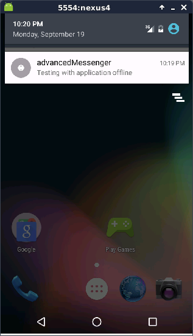  
This should launch the application itself where you will get the notification first and then after clicking on it you will see the rest of the application.  
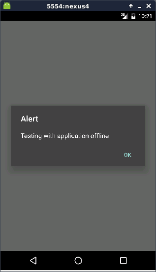

### Lab Complete - Final Notes

You have now seen how easy it is to add push notifications to a mobile application with MobileFirst Foundation, from adding the MobileFirst Client SDK, to adding the JavaScript API calls to initialize, register and subscribe for push notifications, to setting up push on the server side.  You can see how useful this is to mobile applications you develop, and there are even more capabilities to explore from here.  To find out more, including how to invoke push services on MobileFirst Server from external servers, check out the following links:  

[Sending Notifications - Tutorial](https://mobilefirstplatform.ibmcloud.com/tutorials/en/foundation/8.0/notifications/sending-notifications/)  
[REST API for MobileFirst Server push service](https://www.ibm.com/support/knowledgecenter/SSHS8R_8.0.0/com.ibm.worklight.apiref.doc/rest_runtime/c_restapi_runtime.html#restruntime)
