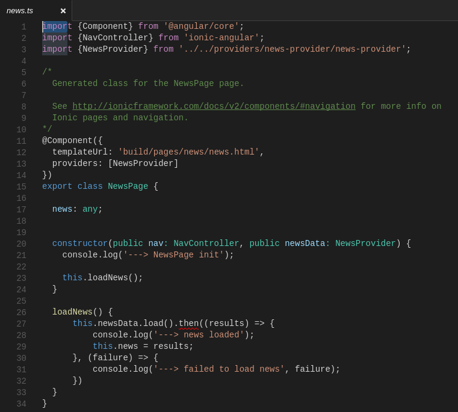

### Lab 5: Mobile Foundation V8 JSONStore Lab

In this lab, we'll introduce the JSONStore component of MobileFirst.  JSONStore is a lightweight, document-oriented storage system that enables persistent storage of JSON documents. Documents in an application are available in JSONStore even when the device that is running the application is offline.

In the current version of the Advanced Messenger mobile app, the News provider simply makes a Java adapter call to our simulated newsfeed server, and displays the returned data on the screen.  In this lab, we'll be modifying the app to persist the news data into a local JSONStore.  The app will then retrieve the data from the JSONStore instead of directly from the adapter.  This is the basic architecture for offline mobile operations.  

#### Setting up the lab

If you completed all the previous labs to this point, then you can safely skip this section.  If however you are starting with this lab, you need to complete these setup steps so that you can work through this lab.  Let's proceed.

1.  Start the lab virtual machine and log in with username **ibm** and password **QQqq1234**.

2. Open a terminal window by clicking the icon on bottom left.

3. Navigate to this directory by typing in the command  
`cd ~/dev/workspaces`

4. Create a working directory for this lab by typing `mkdir am` and then change into this directory by typing `cd am`.

5. We will pull in the code needed for the lab now.  Type the following commands into the terminal:

	```bash
	git init
	git remote add origin https://github.com/andriivasylchenko/advancedMessenger
	git pull origin lab2.65
	```
6.  Open a second terminal window where we will start our MFP Dev Server.  Type the following commands.

	```bash
	~/dev/server/run.sh -bg
	```  
You will see the server start in about 15-20 seconds.


#### Create the new Ionic provider for the JSONStore

The first step is to use the Ionic command line interface (CLI) to create the new provider class that we'll use to interact with the JSONStore component.

1. Open the Terminal window, and navigate to the advancedMessenger folder in the workspace.

	```bash
	cd ~/dev/workspaces/am/advancedMessenger
	```

1. Enter the following Ionic command to build the necessary code files.  Name the new class `storageProvider`.

	```bash
	ionic g provider storageProvider
	```

1. 	When that command completes, look at the contents of the /app/providers folder.  You'll note that a new folder `storage-provider` has been created and populated with a `storage-provider.ts` file. That file contains some basic boilerplate code for Ionic provider classes.  We'll be replacing all of that with our custom code that accesses the JSONStore component.

#### Modify the mobile app to reference the new storageProvider

Even though we haven't yet added our custom code into the `storage-provider.ts` file, we can still add the references to that file into the main mobile application code.  This step will add those references.

1. Start the Visual Studio Code editor, and open the `app.ts` file.

	

2. Add the following line after the last `import` statement on line 5:

	```ts
	import {StorageProvider} from './providers/storage-provider/storage-provider';
	```

3. Edit the `providers` array on line 11 to add a reference to the StorageProvider:

	```ts
	providers: [PushProvider, StorageProvider]
	```

4. Edit the constructor statement on line 18, and add the StorageProvider reference at the end:

	```ts
	constructor(private platform:Platform, renderer: Renderer, private app: App, private push: PushProvider ) {
	```
	should now read:

	```ts
	constructor(private platform:Platform, renderer: Renderer, private app: App, private push: PushProvider, private storage: StorageProvider ) {
	```

5. The final edit we'll make in this file is to register a Javascript event listener that will fire when the JSONStore Cordova plugin has been loaded successfully.  Remember that the Cordova plugins initialize themselves asynchronously, and any code that invokes them prior to that initialization completing will fail at runtime.  The MFP JSONStore plugin fires the event `mfpjsonjsloaded` when it has finished loading. Our `app.ts` file will need to listen for that event, and then invoke the new StorageProvider's init() method.

	Add the following code block immediately after the existing call to `renderer.listenGlobal()`:

	```ts
	renderer.listenGlobal('document', 'mfpjsonjsloaded', () => {
      console.log('--> MFP JSONStore API init complete');

      this.storage.init();
    })
    ```

6. Save the changes to the `app.ts` file.

#### Implement the StorageProvider code

Now we'll build out the actual JSONStore provider implementation in the storage-provider.ts file.  We'll be adding three methods into this file:  

| **Method** | **Description** |
|------------|-----------------|
| init() | This method will initialize the JSONStore, giving it the field names and datatypes that it will contain.|
| put() | This method will insert new collections into the JSONStore, ignoring any duplicate entries.|
| getAll() | This method will retrieve all collections from the JSONStore and place them into a variable for the app to display.|

##### Remove the boilerplate code from the file

1. Open the `storage-provider/storage-provider.ts` file in the editor.

	

2. Make the following edits to remove the unnecessary boilerplate code that Ionic inserted by default:
  + Delete the 2nd and 3rd `import` statements, leaving only the line reading `import {Injectable} from '@angular/core';`
  + Remove both parameters to the constructor() method, making it read `constructor() {}`
  + Change the name of the `load()` method to `init()`.
  + Remove all the code from the `init()` method.

3. The entire file should now look like this:

	

##### Implement the init() method

1. Start with a simple call to the console log.  Add this line as the first statement in the init() method:

	```ts
	   console.log('--> JSONStore init function called');
	```

2. Now define the collections class that will be initialized in the JSONStore component.  We'll add two search fields named `text` and `date` that will be used in the put() method to detect any possible duplicate entries.

	```ts
	   let collections = {
	      news: {
	         searchFields: {text: 'string', date: 'string'}
	      }
       };
    ```	       
3. Finally, add the call to the MobileFirst JSONStore API that initializes the repository.  The call takes the collections variable that we just defined, and specifies success and failure callbacks that simply log a message to the console.

   ```ts
      WL.JSONStore.init( collections ).then((success) => {
         console.log( '--> JSONStore init success')
      }, (failure) => {
         console.log( '->> JSONStore init failed', failure )
      })
   ```

4. So the entire init() method should now look like this:

   

##### Implement the put() method to insert new data into JSONStore

1. Specify the function name as `put`, and have it take a single parameter named `data`.

	```ts
	put(data) {

	}
   ```

2. Inside the function code block, add the basic console log message:

	```ts
	   console.log('--> JSONStore put function called');
	```

3. Next, add two variable declarations `collectionName` and `options` as follows:

   ```ts
      let collectionName = 'news';
      let options = {};
   ```

4. Now add the call to the JSONStore API to add the data into the repository. Since we initialized a collection named `news`, we need to make sure that any data we add goes into that collection.  This statement first gets a reference to the `news` collection with `.get(collectionName)`. Then the call to `add` passes in the data parameter and the options variable.  The success and failure callback methods should look familiar as well.

   ```ts
      WL.JSONStore.get(collectionName).add(data, options).then((success) => {
         console.log('--> JSONStore put success')
      }, (failure) => {
         console.log('--> JSONStore put failed', failure)
      })
   ```

   However - if we attempted to run this code, every call to `put()` would result in the same three rows being inserted into the JSONStore, and we'd have duplicate data.  What we need is to search for possible duplicate data prior to the insert, and then skip the insert for any inserts that would be duplicates.  

1. Change the API call from `add` to `change`:

   ```ts
      WL.JSONStore.get(collectionName).change(data, options).then((success) => {
   ```

2. Modify the `options` variable values to tell JSONStore how to detect any potential duplicates, and what to do with them.  The `replaceCriteria` option specifies the fields in the collection that must be unique.  These correspond to the searchFields that were defined on the `JSONStore.init()` call.  Set the `addNew` option to true, so that the API will add new rows.  And lastly, set the `markDirty` option to false.  This tells JSONStore how to treat changed rows when the app is offline. Any rows marked dirty will be synced with a remote datastore once it comes back online.

   ```ts
      let options = {
         replaceCriteria: ['text', 'date'],
         addNew: true,
         markDirty: false
      };
   ```

3. The put() method should now look like this:

   

##### Implement the getAll() method to retrieve data from the JSONStore

1. Add the getAll method, which will retrieve the entire result set currently stored in the JSONStore repository, and pass it back to the caller.  Start by adding the empty method `getAll()` which takes no parameters.

   ```ts
     getAll() {

  }
   ```  

1. As usual, add the basic console log message:

   ```ts
     console.log('--> JSONStore getAll function called');
   ```

1. Add the same variable declarations as the put() method. In this call, the options variable can be empty.

   ```ts
      let collectionName = 'news';
  let options = {};
   ```

1. Now add the call to the JSONStore API.  Again, we need to get a reference to the correct collection, so the call starts with a get(collectionName), then invokes the findAll() function.

   ```ts
      WL.JSONStore.get(collectionName).findAll(options).then((success) => {
        console.log('--> JSONStore get docs success', success)
      }, (failure) => {
        console.log('--> JSONStore get docs failed', failure)
      })
   ```

1. At this point, the getAll() method should look like this:

	

1. One final coding trick here - since the getAll() function might take a long time to return, the best practice is to wrap the entire contents of the method inside a Promise construct.  Create a new promise just after the console.log() function call, as follows:

   ```ts
      console.log('--> JSONStore getAll function called');

  return new Promise(resolve => {

  })
   ```  

1. Now, move the lines containing the two variable declarations and the JSONStore API call into the empty code block you just created above.  It should look like this:

   ```ts
      return new Promise(resolve => {

        let collectionName = 'news';
        let options = {};

        WL.JSONStore.get(collectionName).findAll(options).then((success) => {
          console.log('--> JSONStore get docs success', success)
        }, (failure) => {
          console.log('--> JSONStore get docs failed', failure)
        })
  })
   ```    

1. Add `resolve()` calls into the success and failure callback blocks, as follows:

   ```ts
        WL.JSONStore.get(collectionName).findAll(options).then((success) => {
          console.log('--> JSONStore get docs success', success)
          resolve(success)
        }, (failure) => {
          console.log('--> JSONStore get docs failed', failure)
          resolve('error')
    })
   ```

1. The `getAll()` method should now look like this:

  

1. Save the changes to the `storage-provider.ts` file.  

#### Modify the Advanced Messenger app to use the new Storage Provider

Now that we've built the Storage Provider, the next step is modifying the mobile app code to use it.  In the current version of the app, the news-provider class calls the backend adapter to retrieve the news data and simply returns it to the news HTML page.  What we're going to do is change the news-provider to persist the news data into the JSONStore instead, and then change the news controller file to retrieve the data from the JSONStore.

##### Modify the News Provider to persist the news data from the adapter

1. Start by opening the `/news-provider/news-provider.ts` file in the editor.

   

2. We need to add references to the new `storage-provider.ts` file.  Add a new import statement at the top of the file, as follows:

   ```ts
   import {StorageProvider} from '../storage-provider/storage-provider';
   ```
   > ![info]  
   > Note the different relative URL reference to the storage-provider.  This is one provider class referencing another, not the main `app.ts` file, so the relative URL must change.

3. Modify the `constructor()` call to add the reference parameter to the StorageProvider.

   ```ts
     constructor(private storage: StorageProvider) {}
   ```

4. It's no longer necessary for the call to the backend adapter to be wrapped inside a separate promise construct.  We'll remove all the code that uses the promise, leaving just the adapter call, and its associated callback routines.

   Before:

   ```ts
    if (this.data) {
      // already loaded data
      return Promise.resolve(this.data);
    }

    // don't have the data yet
    return new Promise(resolve => {
      // We're using Angular Http provider to request the data,
      // then on the response it'll map the JSON data to a parsed JS object.
      // Next we process the data and resolve the promise with the new data.

      let dataRequest = new WLResourceRequest("/adapters/JavaHTTP/", WLResourceRequest.GET);

      dataRequest.send().then((response) => {
        console.log('--> data loaded from adapter', response);

        this.data = response.responseJSON.news;
        resolve(this.data)
      }, (failure) => {
        console.log('--> failed to load data', failure);
        resolve('error')
      })

    });
    ```  

   After:

   ```ts
     let dataRequest = new WLResourceRequest("/adapters/JavaHTTP/", WLResourceRequest.GET);

     dataRequest.send().then((response) => {
        console.log('--> data loaded from adapter', response);

        this.data = response.responseJSON.news;
      }, (failure) => {
        console.log('--> failed to load data', failure);
  })

    ```   

5.  Add a console log message at the end of the `success` callback block (just after the assignment statement `this.data = response.responseJSON.news`).

   ```ts
        console.log('--> putting data into the JSONStore');
   ```
6.  Finally, add the call to the storageProvider.put() method, which persists the data returned from the adapter into the JSONStore repository.  In the next step, we'll modify the front-end HTML code for the news page to retrieve the data from there.  Add this line just after the call to `console.log()`.

   ```ts
        this.storage.put(this.data);
   ```

7.  The `news-providers.ts` file should now look like this:

   

8.  Save the changes to the file.


##### Modify the News page controller to retrieve data from the JSONStore

In this file, we'll replace the call to the existing News provider with a call to the new Storage provider. In fact, we completely remove **all** references to the News provider.

1. Open the `app/pages/news/news.ts` file in the editor.

   

2. Edit the third `import` statement, replacing the reference to the `NewsProvider` with a reference to the new `StorageProvider`.

   ```ts
   import {StorageProvider} from '../../providers/storage-provider/storage-provider';
   ```

3. In the `@Component` directive, replace the reference to `NewsProvider` with `StorageProvider`.

   ```ts
     providers: [StorageProvider]
   ```

4. In the `constructor()` function call, replace the reference to `NewsProvider` with `StorageProvider`

   ```ts
     constructor(public nav: NavController, public newsData: StorageProvider) {
   ```

5. Finally, in the `loadNews()` function, replace the call to the `.load()` method with a call to the .getAll() function in the StorageProvider. The variable `newsData` is now bound to the StorageProvider class in the constructor, so we can leave that name in place.

   ```ts
       this.newsData.getAll().then((results) => {
   ```

6. The `news.ts` file should now look like this:

   

7.  Save the changes to the file.

##### Modify the news.html page to reference data from the StorageProvider

The last edit we need to make is to the actual HTML code for the news tabpage. The data is coming out of the JSONStore repository with a slightly different structure than was returned by the adapter.  All we're doing is correcting the reference to that new data structure.

1. Open the `app/pages/news/news.html' file in the editor.

   

2. Notice the Angular-style bracket references to both `item.date` and `item.text`.  The data structure coming from the JSONStore is nested one level deeper.  Change the references to `item.json.date` and `item.json.text`, respectively.

  

3. Save the changes to the file.


#### Test the changes to the Advanced Messenger application

If you've been running the Live Reload feature of Ionic, your changes should have been automatically reloaded in the browser. If not, relaunch the `ionic serve` command from the terminal to see and test these changes.  Keep the Javascript console open to see the console log messages, and verify that the JSONStore component is persisting and serving up live data.

Congratulations, you have completed the lab!


[info]: ../common/info.png "Information"
