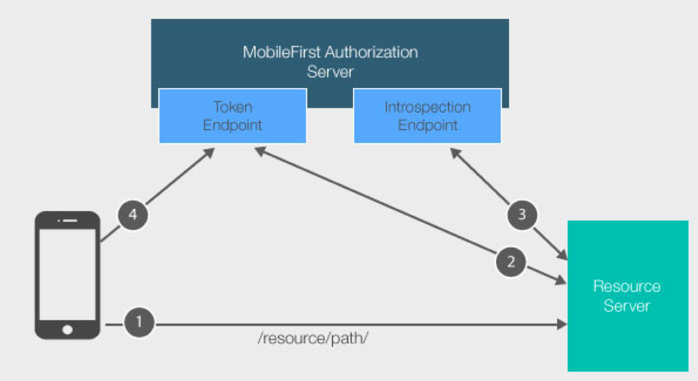
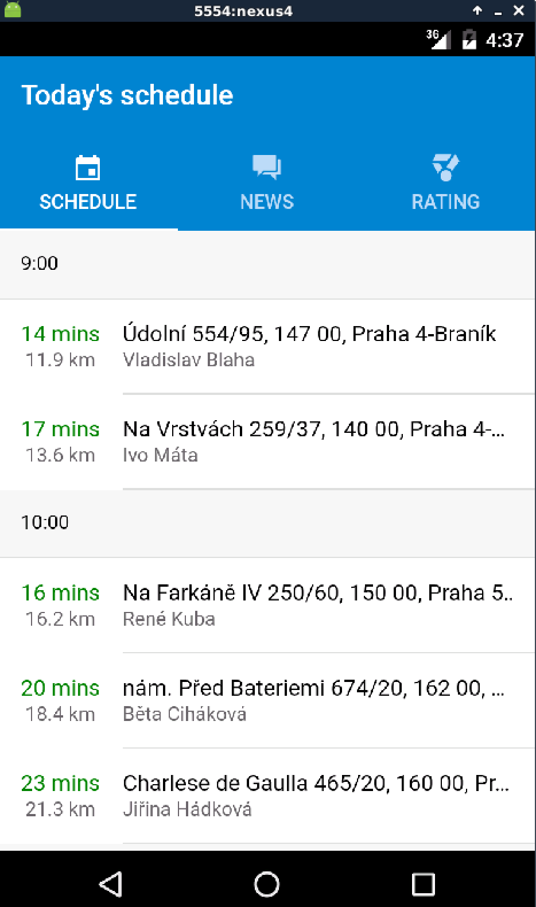

# Lab 6: Authenticating external resources using MobileFirst Foundation V8


## Lab Introduction

In this lab, we will implement a security layer for the schedule service. If you have completed the previous labs, you will recall that the current version of the Advanced Messenger app gets its schedule data for the first page directly from the mockServer nodeJS backend application. However, the mockServer backend does not implement any security protocols, which means that it may be called from any app that knows the service URL.

The security layer that we implement will ensure that any caller has the required MobileFirst scope credentials. Also, the mobile app code will be changed so that it submits the appropriate credentials.  All of this will be enabled through the MobileFirst Platform API.

For additional information on authenticating external resources, please follow this link:
[https://mobilefirstplatform.ibmcloud.com/tutorials/en/foundation/8.0/authentication-and-security/protecting-external-resources/](https://mobilefirstplatform.ibmcloud.com/tutorials/en/foundation/8.0/authentication-and-security/protecting-external-resources/)

## Basic security flow  




The MobileFirst Server has a component called the **introspection endpoint** which is capable of validating and extracting data from a MobileFirst **access token**. This introspection endpoint is available via a REST API. The following sequence describes the security flow:

1. A mobile application with the MobileFirst Foundation client SDK makes a resource request call (or any HTTP request) to a protected resource with or without the Authorization header (**client access token**).
2. To communicate with the introspection endpoint, the **filter** on the resource server needs to obtain a separate token for itself. Because the introspection endpoint is an internal resource protected by the scope **authorization.introspect**, the resource server (in our code example, the mock server) needs to obtain a separate token in order to send any data to it. This is called a **Confidential Client**. If you attempt to make a request to the introspection endpoint without an authorization header, a 401 &quot;unauthorized&quot; response is returned.
3. The **filter** on the resource server (the mock server) extracts the **client access token** from step 1, and sends it to the introspection endpoint for validation.
4. If the MobileFirst Authorization Server determined that the token is invalid (or doesn&#39;t exist), the resource server redirects the client to obtain a new token for the required scope. This part happens internally when the MobileFirst Client SDK is used.

## Registering a new confidential client  

For the external resource server (the mock server) to be able to request a token for the **authorization.introspect** scope, it needs to be registered as a confidential client via the MobileFirst Operations Console. The following steps describe how to define a new confidential client:

1. Login to the MobileFirst Operations Console using [http://localhost:9080/mfpconsole/index.html](http://localhost:9080/mfpconsole/index.html).  The credentials should be admin / admin.

2. From there select **Runtime Settings** from the left menu. Select the **Confidential Clients** tab and click on the **New** button. Type mockServer for both **DisplayName** and **ID.** For **Secret** type the password 123456. For **Allowed Scope** type authorization.introspect and click on **Add**. Your screen should look like the picture below

 

3. Finally click on **Save**.


## Updating the mock server

Now we are going to update the mock server code to be able to act as an external resource validator. Note that an external resource validator can be implemented using custom code, or by using one of the MobileFirst Foundation helper libraries that encapsulate part of the flow. In this example we will use the node.js validator library. Additional details can be found in this link:
[https://mobilefirstplatform.ibmcloud.com/tutorials/en/foundation/8.0/authentication-and-security/protecting-external-resources/node-js/](https://mobilefirstplatform.ibmcloud.com/tutorials/en/foundation/8.0/authentication-and-security/protecting-external-resources/node-js/)

1.  From a terminal window go to the mockServer folder.  If the mockServer is running, kill the process with control-C.

2.  MobileFirst Foundation provides a Node.js framework to enforce security capabilities on external resources. The Node.js framework is provided as an npm module (passport-mfp-token-validation). From the mockServer folder run the following command:

   ```bash
   npm install passport-mfp-token-validation@8.0.X
   ```
3. Using any text editor (such as the VS code editor included in the lab image), open the file `./mockserver/server.js` and add the code shown below at the beginning of the file. Note that the code includes the confidential client ID and the password we defined before.

   ```
   var passport = require('passport-mfp-token-validation').Passport;
   var mfpStrategy = require(&#39;passport-mfp-token-validation').Strategy;

   passport.use(new mfpStrategy({
      authServerUrl: 'http://localhost:9080/mfp/api',
      confClientID: 'mockServer',
      confClientPass: '123456',

      analytics: {
         onpremise: {
            url: 'http://localhost:9080/analytics-service/rest/v3',
            username: 'admin',
            password: 'admin'
         }
      }
   }));
   ```

3. Now add the following initialization code after `app.use(compression());`

	```
	app.use(passport.initialize());
	```

4. Add the additional passport.authenticate parameter to the `app.get('/schedule')`.
The function should look like the code below. Note that the scope `restrictedData` matches what we have defined under scope-elements mapping in the MobileFirst Operations Console for the advancedMessenger mobile application.

	```
	app.get('/schedule',
	  passport.authenticate('mobilefirst-strategy', {
	        session: false,
	        scope: 'restrictedData'
	  }),

	  function (req, res) {
	    console.log('Schedule service was called');
	    var obj = require("./data/schedule.json");
	    res.json(obj);
	  }
	);
	```

5. Now save and close the file ./mockserver/server.js

6. Restart the mock server again by running the command below in a command window

	```
	node server.js
	```

7. Test the updated mock server using a browser. To verify that security is in place, point the browser to [http://localhost:4567/api](http://localhost:4567/api). You should get the message `Mock APIs are running`. But if you point to the URL where security was just implemented: [http://localhost:4567/schedule](http://localhost:4567/schedule), the response is `Unauthorized`. This response is expected as we have not sent the required security tokens.

## Update the Mobile Application

Let's update our mobile application to use the MobileFirst Foundation client SDK to make the resource request call for `/schedule`.

1. Open the file `./app/providers/schedule-provider/schedule-provider.ts`

2. Find the code section for `load() { ..}`  and replace it with the code section below. Make sure you write your local ip address where noted:

	```javascript
	  load() {
	    console.log('---> called ScheduleProvider load');

	    if (this.data) {
	      // already loaded data
	      return Promise.resolve(this.data);
	    }

	    // don't have the data yet
	    return new Promise(resolve => {
	      let dataRequest = new WLResourceRequest("http://<your local ip address>:4567/schedule", WLResourceRequest.GET);
	      dataRequest.send().then((response) => {

	        console.log('--> data loaded from adapter', response);
	        this.data = response.responseJSON.delivery;
	        resolve(this.data)
	      }, (failure) => {
	        console.log('--> failed to load data', failure);
	        resolve('error')
	      })
	    });
	  }
	```

3. After this change, save the file `./app/providers/schedule-provider/schedule-provider.ts`  and run the mobile application again. You should be able to see the same schedule data, but now the call is being properly authenticated.

### Secure the Google API

Now we will update the file `./app/providers/schedule-provider/schedule-provider.ts` again. This time by using our mock server we will secure the call to the Google API that calculates the distance.

1. Open the file `./app/providers/schedule-provider/schedule-provider.ts`, and find the code section for `calc(destinations) { ..}`.  Replace it with the code section below. Make sure you write your local ip address where noted:

	```javascript
	    calc(destinations) {
	      console.log('---> called ScheduleProvider calc');
	      if (this.distance) {
	        // already loaded data
	        return Promise.resolve(this.distance);
	      }

	      return new Promise(resolve => {
	            let dataRequest = new WLResourceRequest("http://<your local ip address>:4567/distance", WLResourceRequest.GET);
	            let curtime = Date.now();
	            let origin = '50.019275,14.347424';
	            let googleParams = 'origins=' + origin + '&destinations=' + destinations + '&departure\_time=' + curtime + '&traffic\_model=best\_guess';
	            console.debug('google params', googleParams);
	            dataRequest.setQueryParameter("origins", origin);
	            dataRequest.setQueryParameter("destinations", destinations);
	            dataRequest.setQueryParameter("departure\_time", curtime);
	            dataRequest.setQueryParameter("traffic\_model", "best\_guess");
	            dataRequest.send().then((response) => {
	              console.log('--> data loaded from adapter', response);
	              this.distance = response.responseJSON;
	              console.debug('Schedule calc data', this.distance.rows[0].elements);
	              resolve(this.distance.rows[0].elements);
	            }, (failure) => {
	              console.log('--> failed to load data', failure);
	              resolve('error')
	            })
	          });
	    }
	```

2. After this change save the file `./app/providers/schedule-provider/schedule-provider.ts`

### Add the Google API into the mockServer

Now that we have updated the mobile app call to the distance calculation we will need to update our mock server to add the distance calculation service.

1. Open the file the file `./mockserver/server.js` and add the following line at the beginning of the file

	```
	var request = require('request');
	```

2. Also add the following code after the `app.get('/schedule' …);` function. Note that this new `app.get('/distance..);` is a protected external resource that calculates distances by leveraging the Google APIs.

	```
	app.get('/distance', passport.authenticate('mobilefirst-strategy', {
	        session: false,
	        scope: 'restrictedData'
	    }), function (req, res) {
	    console.log('Distance service was called');
	    var googleURL = 'https://maps.googleapis.com:443/maps/api/distancematrix/json';
	    var origins = req.query['origins'];
	    var destinations = req.query['destinations'];
	    var departure\_time = req.query['departure\_time'];
	    var traffic\_model = req.query['traffic\_model'];
	    var path = googleURL + '?origins=' + origins + '&destinations=' + destinations + '&departure\_time=' + departure\_time + '&traffic\_model=' + traffic\_model;
	    console.log('--> requested path ' + path);

	    var options = {
	        uri: encodeURI(path),
	        method: 'GET'
	    };

	    request(options, function(error, response, body) {
	        if (!error && response.statusCode == 200) {
	            res.json(JSON.parse(body))
	        } else {
	            res.json({"status": response.statusCode, "error": error, "fullResponse": response})
	        }
	    })
	});
	```

3. Now save and close the file `./mockserver/server.js.`

4. Restart the mock server again by running the command below in a command window

	```bash
	node server.js
	```

### Add the distance calculation into the mobile app

1. Now let's open the file `../advancedMessenger/app/pages/schedule/schedule.ts` and uncomment the following lines so the calculation can be displayed in the mobile app:

	```javascript
	//   this.schedule.calc(geos).then((results) => {
	//       for (var i=0; i < results.length; i++) {
	//           this.delivery[i].distance = results[i].distance.text;
	//           this.delivery[i].duration = results[i].duration.text;
	//       }
	//   })
	```

2. Save the file `../advancedMessenger/app/pages/schedule/schedule.ts` and run the mobile application again. You should now see the distance calculation in the mobile app as shown below



### Lab Complete - Final Notes

You have now seen how easy it is to add secure external NodeJS resources with MobileFirst Foundation and add the appropriate server-side and client-side logic for this interaction.  You can see how useful this is to mobile applications you develop, and there are even more capabilities to explore from here.  

To find out more, including how to protect external Java or .NET resources, check out the following link:  

[Protecting External Resources - Tutorial](https://mobilefirstplatform.ibmcloud.com/tutorials/en/foundation/8.0/authentication-and-security/protecting-external-resources/)  
[REST API for MobileFirst Server push service](https://www.ibm.com/support/knowledgecenter/SSHS8R_8.0.0/com.ibm.worklight.apiref.doc/rest_runtime/c_restapi_runtime.html#restruntime)

Congratulations, you have completed this lab!
