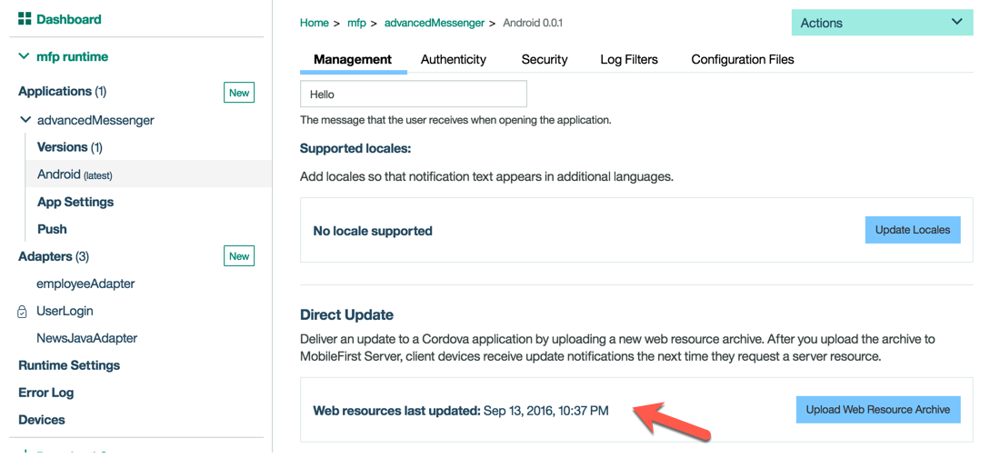
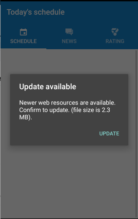
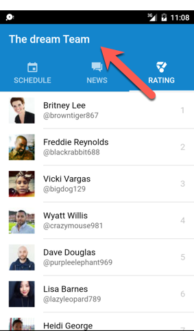
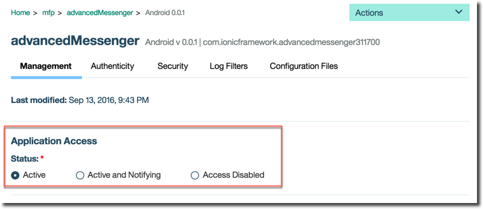
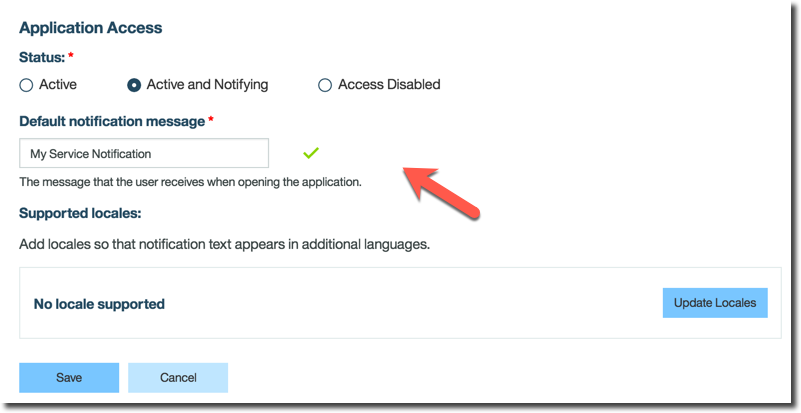
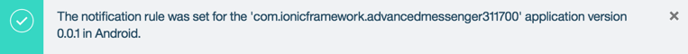
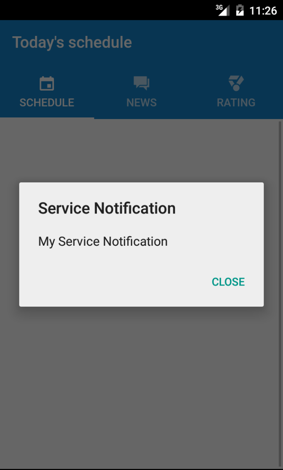
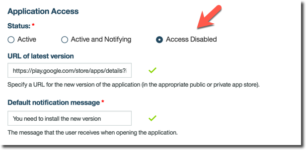
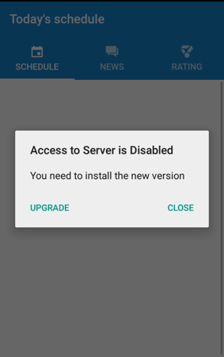

# Lab 7: Using Direct Update and Remote Disable features #

Application management features, in particular **Direct Update** and **Remote Disable** for our application, are two features that can really simplify life for the developer and operational team.  They can ensure continuous delivery of critical updates and ensure that your end users are up to the latest version.  In this lab, we will see how easy it is to use these application management features.  Let's get started.

## Getting Started with this Lab

### advancedMessenger Application ###

The starting point for this lab is the completed advancedMessenger application from the previous lab.  You have two options to continue with this lab.  

**Option 1**

If you’ve finished the previous lab and tested successfully, you can start directly from there and just continue with the instructions starting in the next section.

**Option 2**

If you don't have a stable version of the application or are just starting with this lab, you can retrieve it from GitHub.
Enter the following commands to pull the code for this lab:

```
`cd ~/dev/workspaces/am`
`git init`  
`git remote add origin https://github.com/andriivasylchenko/advancedMessenger`  
`git pull origin lab2.70`

```
After downloading you have the following folder structure:

```
am/
	/advancedMessenger
	/employeeAdapter
	/JavaHTTP
	/mockServer
	/UserLogin
```

First, start the local MobileFirst server (if not yet started) from terminal by entering the following command:

```
	~/dev/server/run.sh -bg

```
Next, enter the following commands:

```
cd advancedMessenger

cordova platform add android
cordova plugin add cordova-plugin-mfp cordova-plugin-mfp-jsonstore cordova-plugin-mfp-push

npm install
gulp build

mfpdev app register
cordova prepare

cd ../employeeAdapter
mfpdev adapter deploy

cd ../UserLogin
mfpdev adapter deploy

cd ../JavaHTTP
mfpdev adapter deploy
```

## Direct Update feature

In previous labs, we have been using the `gulp watch` command to watch changes made in our application folder and see live updates on the simulated device.

This works great for development but it is not possible when the application is already deployed to end users' devices.

With Direct Update, hybrid applications (for the Android, iOS and Windows Phone 8 environments) can be updated "over-the-air" with updated/refreshed versions of the web resources, directly from the MobileFirst Server.

*** Direct Update advantages ***

- Using Direct Update, organizations can ensure that users always use the latest version of the application
- Better control of application versions, by notifying users of pending updates or preventing the use of obsolete versions
- Updates that are deployed to the MobileFirst Server are automatically pushed to user devices
- Possible to push an update silently without user interaction (requires creating a custom Direct Update -- see below)

So on with the lab ...

**1. Start the app on Android emulator**

For this demonstration, we will run the current version of the advancedMessenger mobile app on an emulated Android device.

The starting point of the directory structure should look like the following :

```
am/
	/advancedMessenger
	/employeeAdapter
	/JavaHTTP
	/mockServer
	/UserLogin
```

Ensure you are in the top-level directory of the application

```
cd ~/dev/workspaces/am/advancedMessenger
```

Enter the following command to launch the app on the emulated device.  It will take a few minutes for the emulator to launch.

```
ionic run android
```

The application should now be launched on the device.

**2. Update your app**

So let's imagine you need to change something inside the app for a security issue, a bug fix or even add a new feature.

In our demonstration, we want just to replace the "Our Heroes" title with a different title like "The Dream Team"

For that you will need to modify your application code as follows.

In the file rating.html (advancedMessenger/app/pages/rating) change the title "Our Heroes" to "The Dream Team"

Before

```
<ion-navbar *navbar secondary>
  <ion-title>Our Heroes</ion-title>
</ion-navbar>
```

After

```
<ion-navbar *navbar secondary>
  <ion-title>The Dream Team</ion-title>
</ion-navbar>
```
- Save your modifications to the file.
- Launch a build of the app using the following command.

```
gulp build
```

**3. Deploy your update**

The goal now is to push the changes to particular apps that have already been deployed on an end-user's device.

The typical way this is done is to package a new release and push it to the public or private app store(s) and the user needs to install the app update, **if** they want and **when** they want.

With MobileFirst Platform Foundation, this can be much easier, and it is under your control.

Let's go back to our app folder and enter the following command:

```
mfpdev app webupdate
```
This command will do 2 things:

1. it will build the web resource package
2. it will upload and deploy the web resource package to our default server (you can find out the default server with command `mfpdev server info`)

Notice the MobileFirst Operations Console shows the last update.



> Note :

> When you want to deploy to a specific server other than your local Dev server, you can type the server name and the runtime name as follow : mfpdev app webupdate <server-target> <runtime>
>
> Or, you can simply create a build to deploy later via the Operations Console or the Admin REST API as part of a DevOps pipeline.

- Now relaunch the application in the emulator (kill the application and relaunch it)

- When the application connects to the MobileFirst Server at startup, the server will check for new web resources for Direct Update.
If new resources are available, a notification dialog box will display on the app.  Click the Update button to update the app and you will see the update download onto the device.

**Update notification popup**



- As mentioned, Direct Update will be checked on the MobileFirst Server when the client app makes a connection to the server (e.g. by adapter procedure invocation, explicit connect API call, etc. in the JavaScript code, depending on the application). In addition, the default setting is for Direct Update to only be checked once-per-session (which was why we restarted the app above, to ensure that Direct Update will be displayed).

- However, developers have the flexibility to override this default behavior by using the MobileFirst API.

- Once the Direct Update has completed, the app will automatically restart. Login to the app again, and navigate to the rating page.  You will see this page is now updated with your change.



## In-App Notification and Remote Disable ##

- Go back to the MobileFirst Operational Console and select the Android version  of the advancedMessenger application.

- Notice that each device app has a version (1.0) and a status (Active) for the Application Access.  





- We are going to send a maintenance notification for the Android version of the application.  Click the checkbox and notice the choices of “Active, Notifying” and “Access Disabled”.  

- The “Access Disabled” choice is used when all access to an application by any device of that type should be disabled.

- We will select “Active, Notifying” so we can send an informational notification.

- Click on “Active and Notifying”.

- Add a default notification message. For example "My Service Notification"


- Click **Save**



- Now launch again your application on the device
- The first time your application accesses the MobileFirst Server, you will see a popup with the notification message.



Ok, now imagine you want to require the user to install and use only the new version of your application, disallowing access to the old version.

For that, you can use the "Access Disabled" Notification.

- Go back to the Operational Console
- Select "Access Disabled" checkbox.
- Add notification message.

For this lab you can enter the following message :  
**"You need to install the new version"**

- Add a url where the user will be redirected for the upgraded app version, such as the Google Play Store or your private enterprise app store.

```
For this lab you can enter the following url :

https://play.google.com/store/apps/details?id=com.micepad.ibmconnect2016&hl=en_GB
```

The screen will be the following



- Click **Save**


- Now launch your application again on the device
- The first time your application connects to the MobileFirst Server, you will see a popup with the service notification message we entered.



Congratulations.  You have completed this Lab!

## Summary ##

In this lab, you have experienced how **Direct Update** and **Remote Disable** features can help the developer and operational team more effectively manage the application lifecycle and enable DevOps-style continuous delivery of new application versions and features.  For more information, check out the following video and labs on MobileFirst Foundation.

**Full video available here :** https://mobilefirstplatform.ibmcloud.com/labs/developers/8.0/advancedmessenger/#collapse2

**More Labs :** https://mobilefirstplatform.ibmcloud.com/labs/

--
frederic_dutheil@fr.ibm.com - 2016


 "Important!"

 "Information"

"Troubleshooting"
