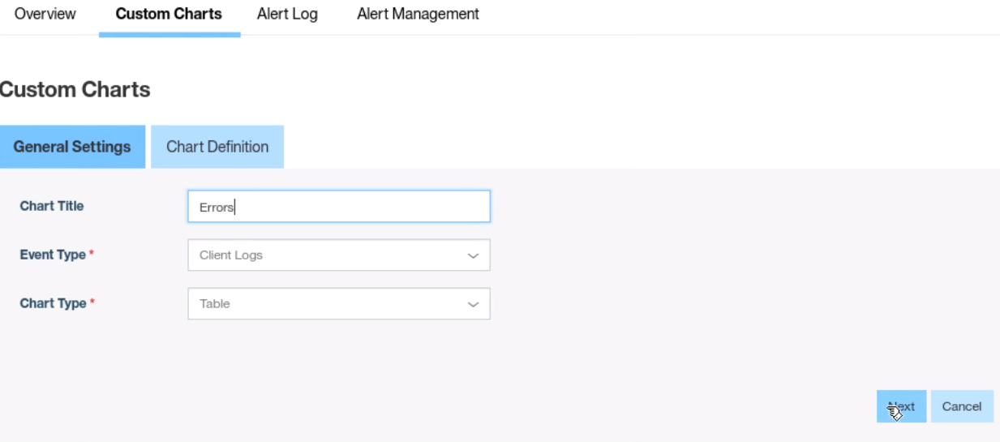

# Lab 8: Inspect Operational Analytics Capability #

Management features in particular **Direct Update** and **Remote Disable** for our application are two features that can really simplify life for developer and operational team.

## Getting Started with this Lab

###  advancedMessenger Application###

The starting point for this lab is the completed advancedMessenger application from the previous lab.  You have two options to continue with this lab.  

**Option 1**

If you’ve finished the previous lab and tested successfully, you can start directly from there and just continue with instructions starting in section below.

**Option 2**

If you don't have a stable version of the application, you can retrieve it from GitHub.
Enter the following commands to pull the code for this lab:

```
`cd ~/dev/workspaces/am`
`git init`  
`git remote add origin https://github.com/andriivasylchenko/advancedMessenger`  
`git pull origin lab2.71`
```
After downloading you will have the following folder structure:

```
    am/
        /advancedMessenger
        /employeeAdapter
        /JavaHTTP
        /mockServer
        /UserLogin
```

First, start the local MobileFirst server (if not yet started) from terminal by entering the following command:

```
	~/dev/server/run.sh -bg

```
Next, enter the following commands:

```
cd advancedMessenger

cordova platform add android
cordova plugin add cordova-plugin-mfp cordova-plugin-mfp-jsonstore cordova-plugin-mfp-push

npm install
gulp build

mfpdev app register
cordova prepare

cd ../employeeAdapter
mfpdev adapter deploy

cd ../UserLogin
mfpdev adapter deploy

cd ../JavaHTTP
mfpdev adapter deploy
```

## Operational Analytics Feature ##

The MobileFirst Operational Analytics server is included as a key part of the MobileFirst Platform Foundation. It can run on the same physical server as your MobileFirst server or can be installed on its own node and clustered for highly-scalable, highly-available monitoring. It is automatically enabled within the development environment with either the Studio or the Command Line Interface. We'll be using the instance packaged in the CLI for this lab.

The Analytics server collects and stores mobile analytics data and enables fast easy searchability and reporting on this data.  The Operational Analytics console enables viewing, management and search of the collected data in a suite of provided views and charts, and has the capability to generate custom charts with a variety of built-in and custom events.

So, let's get started with the lab!

**1. Open your Operations Console**

Open the MobileFirst Operations Console in a browser, if it is not already open, and login with admin/admin.

Click on the link at the top right of the page to switch to the Analytics Console.


Explore the Analytics Console.

Click around the Dashboard view to see information on crashes, app sessions, and server processing time.

Click on the Apps link on the left and explore the data being captured about app usage and devices.  You will also be able to explore further data about crashes and search client logs, which are extremely useful when troubleshooting app issues.

Device search allows you to view details about your application's registered users' devices.  Change the filters to limit the data by time period, application, version, mobile OS, model, or OS version.  

Finally, click on Infrastructure on the left to explore the backend infrastructure serving the app, including server and network metrics, adapters, push notifications, and server log search.  Once again, these data points and views are critical to problem determination and troubleshooting as well as continuous improvement of your apps.

**2. Create a Custom Alert**

MFP Operational Analytics gives us the ability to create custom alerts to make us aware of certain events.  In this example, we are going to create an event based on application responsiveness.

Click on the button on the top right for Alerts (looks like a bell), then Alert Management, and click the **Create Alert** button.

Create an alert like the one in the screen below. (Note the types of events which can trigger alerts in the Event Type dropdown)


**3. Create a custom event**

In this section, we will modify the application to add an event in the case of an incorrect login.
Open the app.ts file from **~/dev/workspaces/am/advancedMessenger/app** in an editor such as Visual Studio Code, as supplied in the VMWare image.

We will add several lines to the challenge handler to catch a failed login and push it to the log.
Modify the code as follows (see snippet file to copy/paste):

```
this.AuthHandler.handleChallenge = ((response) => {
        console.log('--> inside handleChallenge');

        if(response.errorMsg){
          var msg = response.errorMsg + '<br>';
          msg += 'Remaining attempts: ' + response.remainingAttempts;
          WL.Logger.error("Auth error: " + response.errorMsg);
          WL.Logger.send();
        }

        this.displayLogin(msg);
    })
```
Save the file, then change to the advancedMessenger directory and run the following command from the terminal:
```
mfpdev webupdate
```
This will allow the app to take effect dynamically like you saw in the previous lab.

Launch the application in the Android virtual device by running the following command:

```
cordova emulate android
```

You can see in the code that we are continually sending the log back to the server.  In a production environment, you would set a minimum number of messages to queue before sending to better optimize app performance.

You will now be able to see the custom log event in the Analytics Console.
On the left side, select Apps.
Then select Client Log Search.
You should see your custom message as below:


**4. Create a custom chart**

In the next step we will create a custom chart to show our new custom events in the Analytics Dashboard.

From the Dashboard page, select the header called 'Custom Charts'.

Select 'Create Chart' and fill in the fields like below:



Click 'Next' and add the following attributes:


Click 'Next', explore the different options for filters.  Notice how the charts change as you change the criteria.


Click 'Save'

You have the ability to import/export custom charts to other environments.  Click on 'Export Chart' and explore the options as well as the data exported.

Congratulations.  You have completed this Lab!

## Summary ##

In this lab, you have discovered some of the powerful capabilities in MobileFirst Operational Analytics.

**Full video available here :** https://mobilefirstplatform.ibmcloud.com/labs/developers/8.0/advancedmessenger/#collapse3
**More Labs :** https://mobilefirstplatform.ibmcloud.com/labs/
--
cbaker@us.ibm.com - 2016


 "Important!"

 "Information"

"Troubleshooting"
