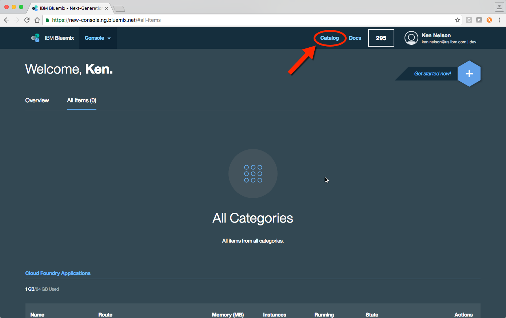
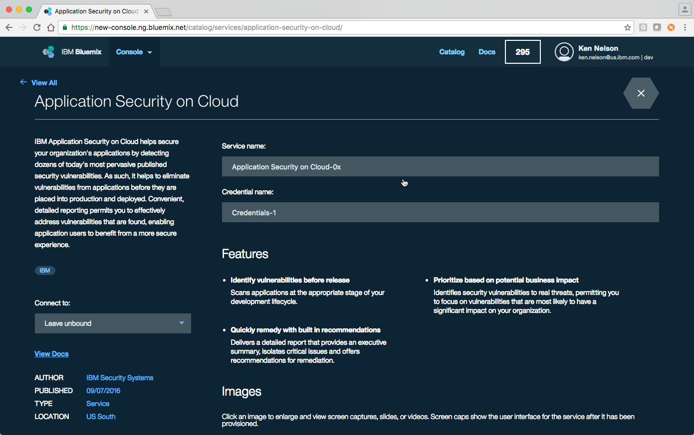

# Lab 9 - Security Scan of Application Binary
In this lab, you will get a chance to use the Application Scanning Service in Bluemix to identify any potential security vulnerabilities in your mobile application so that you can fix them prior to release.

---

# Lab 9 - Objective
In the following lab you will learn:

+ How to scan your application binary using the Application Security on Cloud available on Bluemix
+ How to identify different types of security vulnerabilities identified by the scan

---

# Lab 9 - Before you begin
In this tutorial you will need

+ A [Bluemix account](http://www.bluemix.net)
+ Adobe Acrobat or a program that can be used to view a PDF file
+ An application compiled for Android. If you have followed Labs 1-8, then you should have this

---

# Lab 9 - Step by Step Lab Instructions

# 9.1 Provision the Application Security on Cloud Service

> **Note:** The screen shots for Bluemix in this lab are from the new Bluemix console. If your view looks a little different, try going to the new Bluemix console at [https://new-console.ng.bluemix.net/](https://new-console.ng.bluemix.net/)

1. Start Bluemix by opening a browser and navigating to http://www.bluemix.net

	

2. Login to your Bluemix account by selecting the **Log In** button in the upper right hand corner of the page.

	

3. Follow instructions to login. When you have successfully logged in, you should see a Welcome page.

	

4. In the upper right hand corner of the page, click the **Catalog** link. This will open the catalog of available Bluemix Services.

	

5. Once the **Catalog Page** is open, click the **Security** link from the list of categories on the left side of the page. This will filter the available services on Bluemix to services that are categorized as **Security** types of services.

	

6. With the **Security** services displayed find, then click on, the **Application Security on Cloud** service.

	

7. You are now on the landing page to create a service that can be used to scan your applications. You can either provide a Service Name or take the default. For this lab, take the default Service Name.

	

8. Scroll to the bottom of the page and click the **Create** button.

	

9. The next page will give you an option to select the type of application you want to scan. The options are Mobile, Web, and Desktop. For this lab, click the **Mobile** button.

	

10. The next page will give you an option to select between iOS and Android. For this lab click the **Android** button.

	

11. You are now on the landing page to start the scanning process. Click the **Select file** button in the lower right side of the page.  This will open up a dialog box to select the compiled Android app (APK).

	

	> **Note:** Alternatively you could drag-and-drop the file from your directory tool of choice on to the blue area of the screen that says **Drag-and-drop to select APK file**

12. With the file open dialog displayed, navigate to the location of the compiled application. In our lab environment, the file can be found in `~/dev/workspaces/am/advancedMessenger/platforms/android/build/outputs/apk`. The file that should upload is the android-debug.apk.

	

13. With the file now selected, click the **Scan** button in the lower right corner of the page. This will begin the scan process

	

14. The scan has started when you see the following screen.

	

15. As the scan progresses you will see the scan working on Step 1 of 2. Be patient as the may take a few minutes to get this screen.

	

16. Then you will see that the scan is working on Step 2 of 2.  This step may also take some time to complete.

	

17. The scan is complete when you see the following screen.

	

18. Once the scan is complete, hover the mouse over the download button.

	

19. This will display an option for downloading the report, select the **Security Report** to download. This will download a PDF containing the results of the scan.

	

20. Once the Security Report is downloaded, you can open and view it. The example below is using Google Chrome and displays a link to Security Report named android-debug.pdf.

	

21. Once the Security Report is open for viewing, you can browse the report to gain insight into potential security threats. The Application Security on Cloud scans for the Top 10 OWASP securtiy vulnerabilities.

	

22. Scroll down to the Summary section of the report. Here you will see that there are three security risks identified.

	

---

# Lab 9 - Conclusion

**Congratulations!** You have just scanned your first application and identified potential security vulnerabilities.

In this lab you learned:

+ How to scan an application for security vulnerabilities using Application Security on Cloud available in Bluemix.
