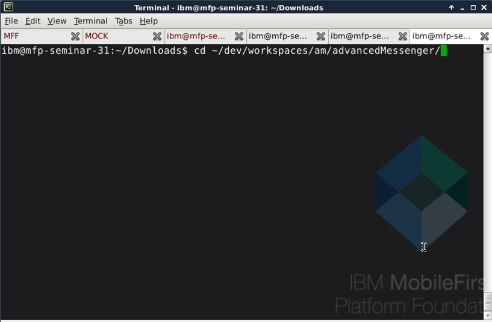
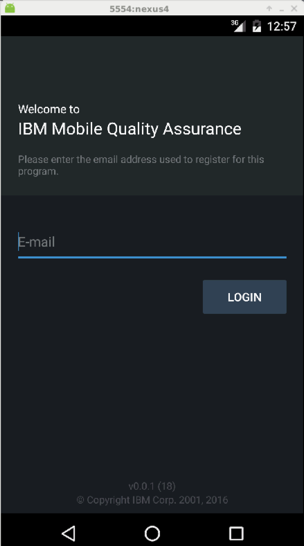
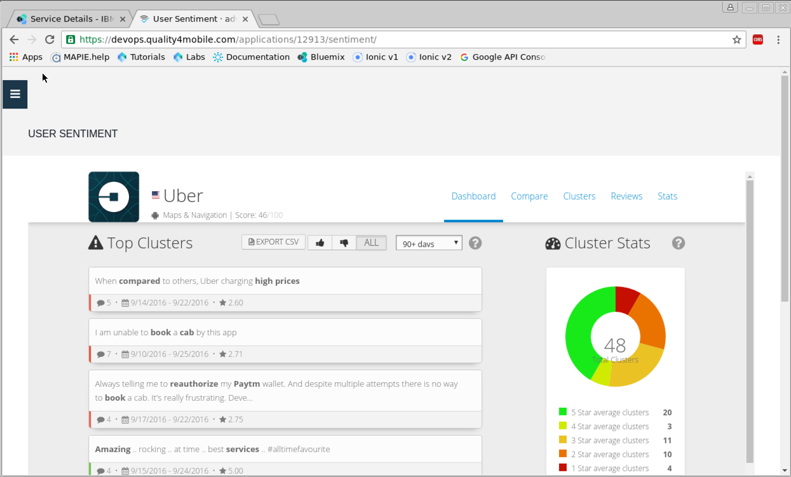

# Lab 10 - Using the Mobile Quality Assurance Service
In this lab, you will get a chance to use the Mobile Quality Assurance service in Bluemix to test mobile application builds on device, which enables you to report bugs and feedback in testing or in production.  It also provides key views into user sentiment of your application once it is has been published to public apps stores, which helps you maintain and continually enhance your app based on user sentiment and feedback.

---

# Lab 10 - Objectives
In the following lab you will learn to:

+ Instantiate the Mobile Quality Assurance (MQA) service on IBM Bluemix
+ Instrument an application to leverage MQA
+ Review bug reports and feedback using the MQA service on IBM Bluemix
+ Upload application binary for distribution
+ Distribute an application build using MQA
+ Configure and view user sentiment of Consumer Applications

---

# Lab 10 - Before you begin
In this tutorial you will need

+ A [Bluemix account](http://www.bluemix.net)
+ Source code for labs 1-8

---

# Lab 10 - Step by Step Lab Instructions

## Section 1 - Instantiate Mobile Quality Assurance service on IBM Bluemix

1. Start Bluemix by opening a browser and navigating to http://www.bluemix.net

	

2. Login to your Bluemix account by selecting the **Log In** button in the upper right hand corner of the page.

	

3. Follow instructions to login. When you have successfully logged in you should see a Welcome page.

	

4. In the upper right hand corner of the page, click the **Catalog** link. This will open the catalog of available Bluemix Services.

	

5. Once the **Catalog Page** is open, click the **Mobile** link from the list of categories on the left side of the page. This will filter the available services on Bluemix to services that are categorized as **Mobile** types of services.

	> **Note:** You may have to scroll to see the Mobile link on the left side of the page.

	

6. With the **Mobile** services displayed, find and click on the **Mobile Quality Assurance** service.

	

7. You are now on the landing page to create a service that can be used to configure Mobile Quality Assurance for your application.

	

## Section 2 - Configure Mobile Quality Assurance
1. You can *optionally* change the service name if you do not like the default Service name generated. In this example the Service name is set to advancedMessengerMQA

	

2. Scroll to the bottom an select the **Standard plan** in the Pricing plans section.

	

3. Click the **Create** button in the lower right hand side of the page to create the Mobile Quality Assurance Service. This will create the service.

	

## Section 3 - Configure Mobile Quality Assurance Service

1. Click the **Add MQA App** button to begin the configuration process.

	

2. Enter an App name such as **advancedMessenger**.

	

3. Select platforms to register. For this lab select only the Android platform.

	

4. Press the **Submit** to complete the registration

	

5. Your MQA configuration is complete when you see the following screen:

	


## Section 4 - Instrument Application (Select Android)

1. Scroll to the top of the page and **Click** the **Download SDKs** button.

	

2. This will open a new browser window or tab with links to download the appropriate SDK.

	

3. Download Mobile Quality Assurance plug-in for Apache Cordova SDK. This will open a second page with the actual download link.

	

4. Click the Mobile Quality Assurance plug-in for Apache Cordova link to begin the download.

	

	> **Notice** the Download progress. The file is around 130Mb

	

5. When the download is complete, open a terminal session and navigate to the **Downloads** directory.

	```
cd ~/Downloads
```

	

6. Make a directory to unzip the file that was just downloaded.

	```
	mkdir mqa
	```

	

7. Unzip the file that was downloaded (CordovaPlugin-3.0.18.zip) to the mqa directory.

	```
	unzip CordovaPlugin-3.0.18.zip -d mqa/
	```

	

8. Change directory back to the advancedMessager directory

	```
	cd ~/dev/workspaces/am/advancedMessenger
	```

	

9. Add Cordova MQA Plugin.

	```
	cordova plugin add ~/Downloads/mqa/
	```

	

## Section 5 - Instrument Application

1. Open your **app.ts** file using Visual Studio Code, or IDE of your choice.

	

	> **Note:** For more information on instrumenting your application with the MQA Plug-in for Apache Cordova, visit [here](https://www.ibm.com/support/knowledgecenter/SSJML5_6.0.0/com.ibm.mqa.uau.saas.doc/topics/t_start_cordova_session.html).

2.	Make a declaration for MQA.  Under the import statements in the app.ts file enter the following:

	```
	declare var MQA: any;
	```

	

	This will prevent the compiler from throwing errors.

3. Next, after the MFPInitComplete() function, create a new function called MQAInit().

	```javascript
	MQAInit(){
		console.log('--> calling MQA start session');

		MQA.startNewSession(
	 	{
	      mode: "QA",  // or mode: "MARKET" for production mode.
	      android: {
	      		appKey: "your_MQA_Android_appKey" ,
	         	notificationsEnabled: true
			}
		}, {
	      success: function () {
	      		console.log("Session Started successfully");
	      },
	      error: function (string) {
	      		console.log("Session error" + string);
	      	}
		});
	}
	```

	

4. Next you will need to replace the "your_MQA_Android_appKey" with the app key found in the MQA Service. To do this, first go to your MQA Service you created earlier. Then **Click** the **Show App Key** button.

	

5. With the App Key showing, select and copy the key to the clipboard.

	

6. Replace the "your_MQA_Android_appKey" with the App Key that you copied to the clipboard.

	> **Note:** Make sure you use your app key, or you will not be able to view any bugs or feedback later.

	

6. Finally you will need to add the call to the MQAInit() function inside the MFPInitComplete() function.

	

7. **Save** your changes.

## Section 6 - Build and Run App

1. Next, build the application by opening a terminal session, if not already open. Navigate to your `~/dev/workspaces/am/advancedMessenger` directory. Then type:

	```
	cordova prepare
	```

	

2. Next, run the application using ionic. This will push the latest application to the mobile device emulator.

	```
	ionic run android
	```

	

3. The first time the application runs, it will require you to provide an email address so that the application can be registered.

	

4. Once you have provided an email address and MQA has registered the user, a wizard screen will open to guide you through the process of using MQA.

	

## Section 7 - Report a Bug

1. Device shaking is not supported in the Android emulator. There is however a button at the top of the screen that can be used to report a bug or provide feedback. Press and hold the icon in the upper left hand corner of the device.

	

	This will open a drop-down with a link for advancedMessenger 0.0.1, Tap to report problem or give feedback.

	

	Press this link, it will open a Create Report dialog where you can choose to either report a bug or give feedback.

	

2. **Press** the **REPORT A BUG** button.

	

3. This will open the bug report form. Here you will need to enter a **Title** for the report. Optionally you can enter one or more **Actions Performed**, **Expected Results**, **Actual Results**, and **Severity**.

	

	You can annote the default image by double clicking it.

	

	With the image open you can draw on the screen and blur fields.

	

	You can add additional attachments such as additional images or even a video by either pressing the MQA menu item that looks like a paperclip or by pressing the New Image button at the bottom of the screen.

	

4. To complete the bug report, use the MQA Menu to Upload the report. 	
	

	Review the options available via the MQA menu by clicking the option icon. If the "Upload only via WiFi" checkbox is checked, then the report will only be upload if the device is using WiFi.

	

	> **Note:** With the Android emulator you can only submit one bug report at time. Because of this, you have to stop and restart the application to submit another bug.

## 8 - Review Bug Reports

Now that a bug has been created it is time to review the bug.

1. If not already open, open a browser, login, and select the MQA service that was created in step 1. If your browser is still open and on the MQA service that was created in step 1, refresh your page.  You should notice that you have a bug identified in the dashboard.

	

2. Click on the bug count to open Bug Reporting Index screen. This will show a list of the bugs that have been identified. On the left-hand side you will see a menu with options such as **Sessions**, **Bugs**, **Feedback**, & **Crashes** for Preproduction. There are similar options for Production. You can also modify the settings for MQA such as branding, notifications, and integrations with other software such as JIRA and GitHub. You can also configure User Sentiment.  For now we will work with the Bug Reporting Index.

	

	> **Note:** If pop-ups are blocked, you will not be able to see the list of bugs as the link opens a new window/tab. To view the list of bug please ensure that pop-ups are not blocked.

3. With the **Preproduction | Bugs** menu option selected, scroll until you see the **DETAILS** link for the recently created bug. **Click** the **DETAILS** link to open the bug details.

	

4. With the Bug Report Detail page open, you will get some basic information about the bug. You can scroll up and down the page to view the basic information.

	

	At the bottom of the page you can click the images to expand them for a more detailed view.

	

	To view the session details of the bug, click the **FULL SESSION DETAILS** link.

	

	This will display additional information about the state of the device, networking, etc.

	

	Finally, **click** the **Show Initial Conditions** checkbox to show information about the initial state of the device before the application began running.

	

	Checking the checkbox will present the following:

	

## Section 8 - Upload Application Binary for Distribution (Optional)

1. Another feature that Mobile Quality Assurance provides is the ability to distribute application builds to testers. To do this, you will need to upload your application binary to MQA. Start by expanding the **Management** menu option, then **click** the **Builds** menu option.

	

2. This opens a page to upload your application binary either by dragging and dropping the file on the space indicated by the dashed-lined box, or by pressing the **Choose file to upload** button.

	

3. **Click** the  **Choose file to upload** button and then navigate to the location of the Android Application Binary. If you have completed labs 1-8, this should be located in `~/dev/workspaces/am/advancedMessenger/platforms/android/outputs/apk`. Select the `android-debug.apk` file and **click** the **Open** button.

	

	The upload starts and you will see a progress dialog showing the current state of the file upload.

	

	The upload is complete when you see the **Build uploaded successfully** dialog.  **Click** the **Save** button to complete the upload process.

	

	Notice that you now have a build file associated with version 0.0.1.

	

4.	Next you can register participants & groups. To create a participant, **click** the **Participants** menu item under the **Management** menu category.

	

	When the **PARTICIPANTS & GROUP MANAGEMENT** page displays, **click** the **Add Participants** button.

	

	When the **Add Participants** dialog opens, enter a comma separated list of email addresses to invite participants. Optionally you can create and add them to a group by typing a group name in the **Add a group** field. To finish adding participants, **click** the **Add Participants** button. For this lab, simply **click** the **Cancel** button as we will not be adding participants.

	

	Adding groups works in a similar fashion. If you wish to explore, you may **click** the **Groups** tab and then **click** the **Add Groups** button.

	One last option is to copy the **Waiting Room API URL** and send it in an email distribution list. As members register they will show in the waiting room awaiting an administrator's approval.

## Step 9 - Distributing your Application (Optional)

1. To perform a distribution, **click** the **Distributions** menu item under the **Management** menu category. This will open the **Distributions** page.

	

2. **Click** the **Distribute App** button to open the **App Distribution** dialog.

	

3. With the **App Distribution** dialog open, you can select the build you want to send, attach an NDA (if one has been created), select the group or groups to distribute the app to, and add additional email addresses to the distribution list.  Once everything has been configured you can **click** the **Distribute App** button. For now simply **click** the **Cancel** button as we will not be distributing apps.

	

## Section 10 - Configure and View User Sentiment of Consumer Applications

Consumer applications are applications that are downloadable via the various public app stores such as iTunes and Google Play. The User Sentiment Analysis feature of Mobile Quality Assurance will analyze user feedback and provide recommendations for future enhancements.

To use User Sentiment Analysis you will need to configure it with an app that is in one or more of the public app stores.

1. To start, **click** the **User Sentiment** menu item.

	

2. Next **click** the **App Settings** button to open the **App Settings** page to configure the application.

	

3. With the **App Settings** page open, **check** the **Activate User Sentiment integration** checkbox found in the **User Sentiment Integration** section.

	

4. With the **Activate User Sentiment integration** checkbox checked, a text input will be displayed showing the **advancedMessenger** applicaiton name. Because the **addvancedMessenger** application does not exist on a public app store you will not be able to configure the rest of the integration. However, if you enter a known application such as **Uber** you will get a list of potential matches.  **Check** the radio button next to the option that says **Uber**.

	

5. Save your settings by scrolling to the bottom of the page and **click** the **Save settings** button.

	

6. After saving the settings, **scroll** back to the **User Sentiment Integration** section and you will notice that the Integration Status has changed from **Not Active** to **Active**.

	

7. **Click** the **User Sentiment** menu item, and this time notice that there is available feedback.

	

	**Scroll** to the **Attributes** section and you will see how the application breaks down with respect to 10 specific attribute categories (Privacy, Content, Interoperability, Elegance, Security, Pricing, Usability, Stability, Satisfaction, and Performance). Not all applications will have values for each category as comments may not be identified that match a particular category.

	

8. Continue exploring the User Sentiment for the application by **clicking** the **Compare**, **Clusters**, **Reviews**, and **Stats** tabs.

	The **Compare** allows you to compare this app with up to 5 additional applications. Simply enter the name of the application or applications you want to compare in the **Search for apps** textbox and hit enter. It will be added to the list of apps. The stats for all apps identified will be shown in the graph as well as stats for the category of apps.

	

	The **Clusters** shows similar keywords identified in reviews. This will tell you how the same clusters or groupings of words or phrases have been identified in multiple reviews. You can limit the reviews to 1, 3, 14, 30, or 90 days.

	

	The **Reviews** will show all the reviews from the the public app store as well as graph on a daily basis the positive and negative reviews.  You can limit the reviews to specific categories such as Content, Elegance, etc. as well as the date range of reviews.

	

	Finally the **Stats** tab shows running average score for a particular category such as Quality, Statisfaction, Usability, etc.  You can change the category by select the desired category from the list on on the left hand side.

	

# Lab 10 - Conclusion

**Congratulations!** You have completed the Mobile Quality Assurance lab.

In this lab you learned to:

+ Instantiate Mobile Quality Assurance (MQA) service on IBM Bluemix
+ Instrument an application to leverage MQA
+ Review bug reports and feedback using the MQA service on IBM Bluemix
+ Upload application binary for distribution
+ Distrbute an application using MQA
+ Configure and view user sentiment of consumer applications
