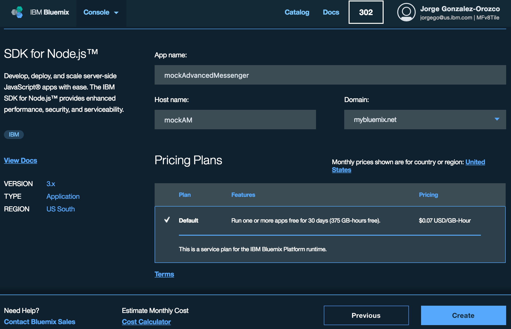
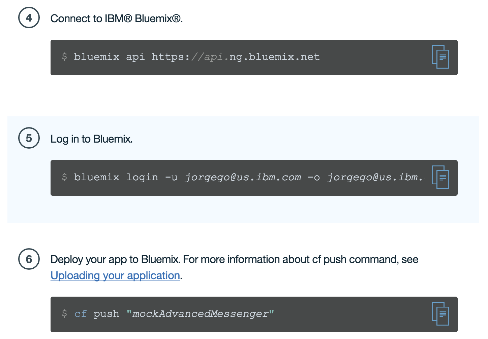

# Lab 11: Moving the Node.js mock server to Bluemix

## Lab Introduction

As you may recall, our mock server is a Node.js based application that runs locally and provides REST services. It consists of the file **server.js** which has the services logic plus a **data** folder where we have the service sample data as json files plus a **node_modules** folder that has the required dependencies. The objective of this lab is to have this Node.js server run in the cloud in Bluemix as a Cloud Foundry application by using the Bluemix SDK for Node.js runtime. So let's get started!

## Bluemix Configuration

1.  Using your Bluemix credentials login into Bluemix using the URL below: [https://new-console.ng.bluemix.net/](https://new-console.ng.bluemix.net/)  
2.  Once logged in, click on the **Catalog** option in the top right to show the list of services available in Bluemix. Once on the **Catalog** page click on the **Compute** option on the left column to show all the runtimes available, as shown:

 

3. On the **Compute** list page, select **Cloud Foundry Applications**, and from the **Cloud Foundry Application** page select **SDK for Node.js**.
4. On the **Create a Cloud Foundry Application** page, type **mockAdvancedMessenger** as the App name. Just to make it shorter rename the Host name field as **mockAM**. If you get an error message indicating that the host name has already been used, just change the name to something else. Your page should look like the picture below:

  

5.  Now click on the **Create** button.
From here we will need to follow the instructions to download and install both Cloud Foundry and Bluemix command line interfaces (CLI) and the starter code.
6.  Click on the **Download CF Command Line Interface** and in the next page under **Installers** select Debian 64bit to download the installer.
7.  In the same way, from the previous page select the **Download Bluemix Command Line Interface** button and click on **Download for Linux(64-bit)**. You will be using these two CLIs to connect to Bluemix and push the mock server application to the cloud.
8.  Finally, from the same page where you downloaded Cloud Foundry and Bluemix CLI's, click on the **DOWNLOAD STARTER CODE** button.

## Deploying mockServer to Bluemix

Now let's install the three files we just downloaded.

1.  Open a terminal and change to the Downloads directory:  
`cd ~/Downloads`. From there, type in the command below to install the Cloud Foundry CLI. If you are asked for a password use the current user password from the virtual machine (QQqq1234).
```
sudo dpkg -i cf-cli-installer_6.21.1_x86-64.deb
```
2.  To unpack the downloaded Bluemix CLI zip file, type the command below:
```
tar -xvf Bluemix_CLI_0.4.2_amd64.tar.gz
```
3.  Change folders to the Bluemix_CLI folder
```
cd Bluemix_CLI
```
4.  Run the command below to install the Bluemix CLI. If you are asked for a password, use the current user password from the virtual machine.
```
sudo ./install_bluemix_cli
```

5.  To be able to launch the Bluemix and CloudFoundry CLI's without sudo, run the following commands:
```
sudo chown -R ibm:ibm /home/ibm/.cf
sudo chown -R ibm:ibm /home/ibm/.bluemix
```

6.  Let's verify the successful installation of the commands. Run the two commands below from the current location to ensure they execute.
```
cf
bluemix
```
7.  Type the following command to unzip the starter code. Note that we will unzip the files to the folder ~/dev/workspaces/am/sampleNodeApp.

 ```
unzip mockAdvancedMessenger.zip -d ~/dev/workspaces/am/sampleNodeApp
```
8.  Let's explore the files we just unzipped under the **sampleNodeApp** folder.  You will notice that there is a **.cfignore** file which tells the Cloud Foundry CLI what files and folders to ignore when pushing the application to the cloud. Also there is a **manifest.yml** file which defines the memory allocation, the disk quota, the number of instances, the application name and the host. These parameters will be used when the application is installed in Bluemix. Another file is the **package.json**  which defines the dependencies for our application. We can ignore the other files for now.

9. Let's copy these three important files to the mockServer folder by running the commands below
```
cd '/home/ibm/dev/workspaces/am/sampleNodeApp'
cp .cfignore manifest.yml package.json ../mockServer
```
10. Open the server.js file in the mockServer folder and add the following lines at the beginning of the file
```
// cfenv provides access to your Cloud Foundry environment
// for more info, see: https://www.npmjs.com/package/cfenv
var cfenv = require('cfenv');
```

11.  In server.js, replace the code below:
```
app.listen(4567, function(){
    console.log('Express server listening on port 4567');
});
```
with the following section (or copy/paste from the snippet file):

   ```
   // get the app environment from Cloud Foundry
   var appEnv = cfenv.getAppEnv();

   // start server on the specified port and binding host
   app.listen(appEnv.port, '0.0.0.0', function() {
     // print a message when the server starts listening
     console.log("server starting on " + appEnv.url);
   });

   ```

 Basically, now we will get the port number from the Bluemix environment.  Save and close the server.js file.

12.  We are done using the **sampleNodeApp** folder, therefore you can remove it including all the files under it. We will not need it anymore.
13. Let's focus again on the **mockServer** folder. We still need to update a few files we just copied. Open the package.json file and replace all the content with the section below. Note that the only difference is that we have updated the start property and we have added more dependencies.
```
{
	"name": "NodejsStarterApp",
	"version": "0.0.1",
	"private": true,
	"scripts": {
		"start": "node server.js"
	},
	"dependencies": {
	  "express": "4.13.x",
	  "cfenv": "1.0.x",
	  "passport-mfp-token-validation": "8.0.x",
	  "request": "2.74.x",
	  "path": "0.12.x",
	  "compression": "1.6.x",
	  "body-parser": "1.15.x",
	  "cors": "2.8.x"
	},
	"repository": {},
	"engines": {
		"node": "4.x"
	}
}
```
Save and close the package.json file.

14. Reusing the same terminal window from the mockServer folder, run the following commands to connect, login and push the updated mockServer application to Bluemix. You will copy and paste these commands as they are in the **Deploying your app with the command line interface** web page that we used previously to download the CLI's and starter code.  
These commands will have the right parameters such as credentials and Bluemix target space. Note that on the second command you will be asked for your Bluemix account password. Refer to the next picture for these commands and from the ``~/dev/workspaces/am/mockServer`` folder,
copy, paste and execute the line of step 4, 5 and 6 as they are in the **Deploying your app with the command
line** interface page.


15. The result should be something like this:
```
...
App started
OK
App mockAdvancedMessenger was started using this command `./vendor/initial_startup
.rb`
Showing health and status for app mockAdvancedMessenger in org ... / space ... as
...
OK
requested state: started
instances: 1/1
usage: 256M x 1 instances
urls: mockAM.eu-gb.mybluemix.net
last uploaded: Thu Sep 22 17:41:40 UTC 2016
stack: cflinuxfs2
buildpack: SDK for Node.js(TM) (ibm-node.js-4.5.0, buildpack-v3.7-20160826-1101)
state since cpu memory disk detai
ls
#0 running 2016-09-22 07:42:31 PM 0.0% 79.3M of 256M 80.6M of 1G
```

15.  Now let's verify that the mockServer is running in Bluemix.  **Note** that you have to use the host name that you assigned to your app in step 4 above. In my example I set the host name to **mockam2**.

 If you type the following URL in your browser you should be able to see the message **Mock APIs are running**.
```
https://mockam2.mybluemix.net/api
```
The next URL should return **Unauthorized** since it is protected by MobileFirst Server as an external resource.
```
https://mockam2.mybluemix.net/schedule
```
The following URL, which is unprotected, should return a list of employees.
```
https://mockam2.mybluemix.net/employees
```

## Updating the mobile app to use mockServer in Bluemix

Now we will update our mobile application to make sure it's pointing to the new mockServer deployed in Bluemix instead of the local mockServer. As you may remember, the mobile application is issuing direct calls to the mock server (without using MobileFirst adapters) in order to get schedule and distance information.
1. Open the file `~/dev/workspaces/am/advancedMessenger/app/providers/schedule-provider/schedule-provider.ts` in your text editor.
2. In the line below, replace the IP address with the host name you assigned to your app in Bluemix. Again, in my example I used **mockam2**. Remember to remove the port number.  
Before:
```
      let dataRequest = new WLResourceRequest("http://192.168.68.148:4567/schedule", WLResourceRequest.GET);
```
After:
```
      let dataRequest = new WLResourceRequest("http://mockam2.mybluemix.net/schedule", WLResourceRequest.GET);
```
3. Locate the line below and make a similar change to the previous step but leaving `/distance` at the end of the URL.  
Before:
```
      let dataRequest = new WLResourceRequest("http://192.168.68.148:4567/distance", WLResourceRequest.GET);
```
After:
```
      let dataRequest = new WLResourceRequest("http://mockam2.mybluemix.net/distance", WLResourceRequest.GET);
```

## Updating the MobileFirst adapters to use the mockServer in Bluemix

As you may recall if you completed the previous labs, the Java HTTP adapter still points to the local mockServer. Let's update it to point to the new mockServer in Bluemix as well.
1. Open the file `~/dev/workspaces/am/JavaHTTP/src/main/java/com/sample/JavaHTTPResource.java` and update the line below by replacing the IP address with the host name you assigned to your app in Bluemix. Again, in my example I used **mockam2**.  
 Before:
```
		host = new HttpHost("localhost", 4567, "http");
```
 After (*note port 80*):
```
		host = new HttpHost("mockam2.mybluemix.net", 80, "http");
```

2. The same change should be made to the employee JavaScript adapter. Open the file `~/dev/workspaces/am/employeeAdapter/src/main/adapter-resources/adapter.xml`.  
Update the line below:
```
<domain>localhost</domain>
<port>4567</port>
```
To this (note port 80):
```
<domain>mockam2.mybluemix.net</domain>
<port>80</port>
```

3. Now let's build and deploy both adapters. From a terminal window, run the following two commands from both the **employeeAdapter** and the **JavaHTTP** adapter folders.
```
mfpdev adapter build
mfpdev adapter deploy
```


## Running the mobile application
Just to recap, in this lab we have completed the following tasks:
* Created a new Node.js runtime in Bluemix that we will use to run the mockServer Node.js application
* Updated our mockServer code to be able to deploy and run it in Bluemix
* Updated our local environment with Cloud Foundry and Bluemix CLIs and pushed (deployed) the mockServer application into Bluemix
* Updated our mobile app direct calls (those calls that don't use adapters) to point to the mockServer in Bluemix
* Updated both the Java and JavaScript adapters to point to the mockServer in Bluemix

Now we will test the mobile app. Because we have changed the mobile app (client) code we will need to deploy those changes to the server.

1. From the mobile app folder `~/dev/workspaces/am/advancedMessenger` run the following command to update the server with the new client code.
```
mfpdev app webupdate
```
2. The next time the mobile app connects to the server it will get these changes from the server. This feature is called **Direct Update**. Note that if you are running **gulp watch** and **cdvlive android**, the mobile app is already updated and the server will not send any update.
2. When you run the mobile app, open the Chrome browser inspector by typing the url below and then click on the **inspect** link
```
chrome://inspect/#devices
```
You will notice that there is an error in the Android console log. The error is related to getting schedule and distance data. This error is expected because mockServer requires a connection to the MobileFirst server in order to validate scope credentials and submit analytics data.
3. To verify this error, open the Bluemix console and click on the **IBM Bluemix** top left icon, then click on the **All Items** tab and then under **Cloud Foundry Applications** click on the **mockAdvancedMessenger**. Now that you are on the **mockAdvancedMessenger** dashboard, click on the **Logs** tab. If you scroll all the way down you will see the connection error as shown below. 

In the next lab (Lab 12) we will create a MobileFirst server in Bluemix and we will be able to fully test the mobile app end-to-end.

&lt; **LAB COMPLETE** &gt;
