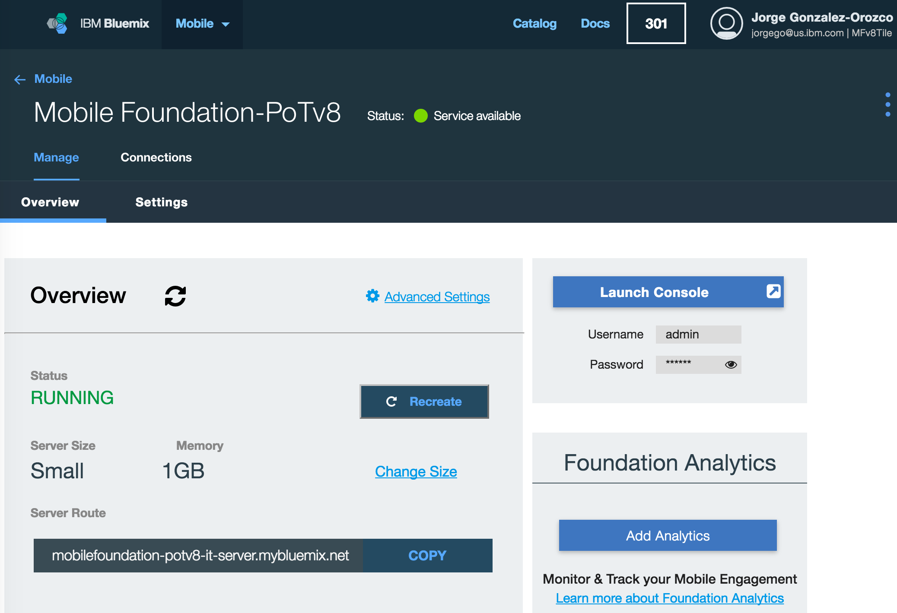

# Lab 12: Creating the MobileFirst Foundation Server instance using the MobileFirst tile in Bluemix

## Lab Introduction

As you may recall, in our previous lab we deployed the mockServer into Bluemix, but we were unable to test the mobile app because the mockServer tried to connect to a local instance of MobileFirst server that didn't exist. In this lab, we will create the MobileFirst Server in Bluemix where the mockServer will be able to connect to it, and this will allow us to test the mobile app end-to-end.

## Bluemix configuration

1. Using your Bluemix credentials, log into Bluemix using the URL below: [https://new-console.ng.bluemix.net/](https://new-console.ng.bluemix.net/)  
2. Once logged in, click on the **Catalog** option in the top right to show the list of services available in Bluemix. Once on the **Catalog** page click on the **Mobile** option on the left column to show all the mobile services available. Click on **Mobile Foundation** and you will land on the page shown below.

Note: You can leave the service name as it is.

3. Scroll down the page. For this lab we will use the **Developer** plan which is selected by default. Click on the **Create** button.
Then on the next page note that we have an instance of the service created. In this page, if you click on the **Settings** tab you can change the Topology, Security and Server Configuration settings. **Do not change any settings for this lab**.

4. Click back on the **Overview** tab and click on **Start Basic Server**. The server deployment can take up to 10 minutes. After the process is complete, you will see MobileFirst Server dashboard as shown below


5. Now click on the **Launch Console** button and login using the username and password provided under the button.
With a few clicks, we have created and successfully deployed a MobileFirst Server now running in Bluemix.

## Remote server configuration

We now need to register this new remote server in our local development environment so that we can deploy mobile application components.
1. In your terminal window, type in the `mfpdev server add` command in the mobile app folder `~/dev/workspaces/am/advancedMessenger`. This will invoke the interactive mode of MFP CLI and allow you to key in your server parameters. **As you fill in these parameters, make sure you use the same (Bluemix) host name and admin password for the MobileFirst Server you created on Bluemix.**
```
ibm@mfp-seminar-31:~/dev/workspaces/am/advancedMessenger$ mfpdev server add
? Enter the name of the new server profile: bluemix
? Enter the fully qualified URL of this server: http://mobilefoundation-mypot-server.mybluemix.net:80
? Enter the MobileFirst Server administrator login ID: admin
? Enter the MobileFirst Server administrator password: **********
? Save the administrator password for this server?: Yes
? Enter the context root of the MobileFirst administration services: mfpadmin
? Enter the MobileFirst Server connection timeout in seconds: 30
? Make this server the default?: No
```
2. After this you should see the message **Server profile 'bluemix' added successfully**.
3. We will now deploy our three adapters to the new server in Bluemix. From a Terminal command window, run the following command from inside all three adapter folders:  
`~/dev/workspaces/am/employeeAdapter`
`~/dev/workspaces/am/JavaHTTP`  
`~/dev/workspaces/am/UserLogin`
```
mfpdev adapter deploy bluemix
```
You will now have all three adapters deployed.
4. The next step is to deploy the server-side app components. Instead of registering the application with the new server and manually adding the security configuration, we will simply export the components from our local server to a file and then import this file to the MobileFirst Server running in Bluemix. Let's do this now.  
Open your local MobileFirst Operations Console in a web browser, login and select **Android** under **Applications/advancedMessenger**, then select **Export Version** from the **Actions** menu at top right as show, saving the file to a location such as `~/dev/workspaces/am`.


5. Now open your remote MobileFirst Operations Console for your MobileFirst Server on Bluemix and select **Import Application** from the **Actions** menu of the top left as shown, browse to the file you download in the previous step and click OK.

Click on the **Deploy** button.

6. Now we need to add the Push credentials, as they are not copied in the export file. On your remote MobileFirst Operations Console, select **Push** under **Applications/advancedMessenger** and type in the **Server API Key** and **Sender ID** as shown below. Note that these values are the same used in the Push Lab. If you don't have them don't worry, as setting up Push is not required to complete this lab.


7. One more setup step for Push is to add the tags. Click on the **Tags** tab, click on **New** and add the tag name **am** and description **test tag** as shown below


8. Now we need to add again the confidential client settings in the same way we did in the local server in a previous lab. *As a recap, for the external resource server (the mock server) to be able to request a token for the authorization.introspect scope, it needs to be registered as a confidential client via the MobileFirst Operations Console.*  
In the remote MobileFirst Operations Console, select **Runtime Settings** from the left menu. Select the **Confidential Clients** tab and click on the **New** button. Type **mockServer** for both **DisplayName** and **ID.** For **Secret** type the password **123456**. For **Allowed Scope** type **authorization.introspect** and click on **Add**. Your screen should look like the picture below:


9. Click **Save** to save the configuration.

## Updating the mockServer in Bluemix to use the MobileFirst remote server

Now we will update the mockServer in Bluemix to leverage our brand new MobileFirst server running in Bluemix.
1. Open the file `~/dev/workspaces/am/mockServer/server.js` in your text editor and update the localhost and port:  
**Before:**
```
    authServerUrl: 'http://localhost:9080/mfp/api',
```
**After:**  
*You can get the remote URL from the remote Console in your browser. Change the port to 80.*
```
    authServerUrl: 'http://<<console host name>>:80/mfp/api',
```
2. Since we will not use analytics on the remote server,  remove the following code section:
```
analytics: {
    onpremise: {
        url: 'http://localhost:9080/analytics-service/rest/v3',
        username: 'admin',
        password: 'admin'
    }
}
```
3. Save and close the **server.js** file.
4. We will now push these mockServer changes to Bluemix.  Open a command window and from the `~/dev/workspaces/am/mockServer` run the following command.  
*Note that you will be prompted for the local Operating System password, which is QQqq1234 on the VMWare image.  Also, we assume that you have the Bluemix and Cloud Foundry Command Line Interface tools already installed in your local environment as covered in the previous lab. If this is not the case, then refer to Lab 11 for instructions.*
```
sudo cf push mockAdvancedMessenger
```

## Updating the mobile app to use the MobileFirst remote server

Let's run this command to make the mobile app use the remote server.  From a terminal window, run the following command from the mobile app folder `~/dev/workspaces/am/advancedMessenger`:
```
mfpdev app config server bluemix
cordova prepare
```

## Testing the mobile app

Now we are ready to test the mobile app. The mobile app now points to a remote MobileFirst Server and to a remote NodeJS mockServer, both running in Bluemix. From a terminal window, run the following command from the mobile app folder `~/dev/workspaces/am/advancedMessenger` in order to build and deploy the app to the Android emulator.

```
cordova prepare
cordova run android
```
After a minute or so, the mobile app is deployed in the Android emulator. If you want to debug your app by using the Chrome browser inspector, type in this URL **chrome://inspect/#devices** and click on **inspect**.
Your mobile app should be able to connect to the remote server and show schedule, news and rating data as shown below:


&lt; LAB COMPLETE &gt;
